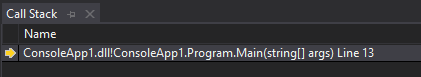
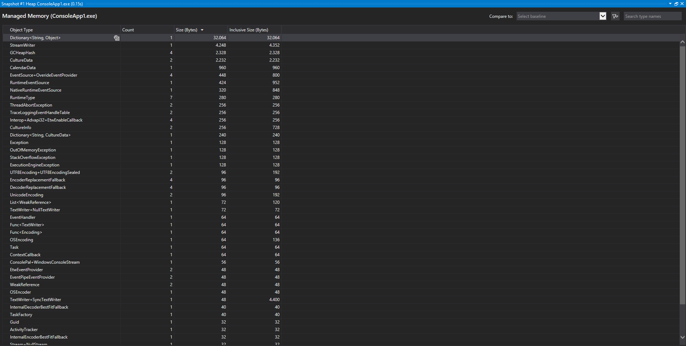

# Develop professionally with JavaScript

---

## Chapter 1 : Introduction

## Chapter 2 : Functions and functional aspects

## Chapter 3 : OOP in JavaScript

## Chapter 4 : ECMA 2015 and newer version

## Chapter 5 : The development process

## Chapter 6 : Testing JavaScript applications

## Chapter 7 : Advanced concepts in the object-oriented programming

## Chapter 8 : The design patterns of the Gang of Four

## Chapter 9 : Architectural patterns and concepts of modern JavaScript Web Frameworks

## Chapter 10 : Messaging

## Chapter 11 : Continuous Integration

---

## Chapter 1 : Introduction

Basic JavaScript syntax

---

## Chapter 2 : Functions and functional aspects

### Features of JavaScript functions

Functions are first-class objects in JavaScript. That means that they can be passed as arguments inside other arguments, they can be assigned to variables, returned from other functions etc. All functions have a name property that represents the name of the function, a length property that represents the number of defined arguments that it has and a prototype property that we'll talk about in chapter 3 when in comes to OOP in JavaScript.

In functions we can use, as well as we can in objects, the keyword ```this```. The keyword ```this``` is based on the context of the function. Example:

```JavaScript
const person = {
    firstName : "Max",
    getFirstName : function(){
        return this.firstName();
    }
}

console.log(person.getFirstName()); // Output : Max
```

In this case ```this``` is the object ```person```. ```this``` is always about the context. If we are not inside any object and use ```this``` on a function, ```this``` points out to the window object:

```JavaScript
getFirstName : function(){
    return this.firstName();
}

console.log(getFirstName()); // undefined
```

Here, we get 'undefined' since we don't have any property named firstName inside the object ```this``` where ```this``` is pointing to.

Functions also build a 'Function-Level-Scope' meaning that we have a defined visibility scope inside functions. Example:

```JavaScript
function example(x){
    if(x){
        var y = 4711;
    }
    for(var i = 0 ; i < 4711; i++){
        // Code
    }

    console.log(y); // 4711
    console.log(i); // 4711
}

example(true);
```

In our case we still get the values because they were defined inside the function level scope. This only works with ```var```, not with ```let```.

In many cases it's better to define all the variables at the beginning of the function. It's a good thing to define all of your variables at the start of the function since you can be sure that you don't repeat yourself. **Declaring all the variables at the start of a function, before using them, is called Variable Hoisting.**

```JavaScript
function example(x){
    var y, i;

    console.log(y);
    console.log(i);

    if(x){
        var y = 4711;
    }
    for(var i = 0 ; i < 4711; i++){
        // Code
    }
}
```

If you choose not to declare the visibility/behavior of your variable by not writing ```let```, ```var``` nor ```const``` before it, it will be seen as a global variable. This is a very bad practice because it can cause name conflicts and other bugs that are very hard to fix.

In JavaScript there is no such thing as proper function overloading. A 'best practice' when it comes to function overloading is setting up a 'config' variable that changes the output of the function. Example:

```JavaScript
function add(x, y, config){
    const result = x + y;
    if(config && config.log){
        console.log(result);
    }

    return result;
}

add(2, 2);
add(2, 2, {log : true});
```

### Standard Methods for JavaScript Functions

In JavaScript, as we said before the keyword ```this``` represents the context that a function is bound to.
All JavaScript functions have some standard functions. This functions are:

- bind
- call
- apply

#### bind

With bind, as well as with the other standard methods, we can change the context of the keyword ```this``` and get that function in return. Example:

```JavaScript
const button = {
    handler : null,
    onClick : function(handler){
        // handler is a callback-handler
        this.handler = handler;
    },
    click : function(){
        this.handler();
    }
}

const handler = {
    log : function(){
        console.log("Clicked on the button.");
    },
    handle : function(){
        this.log();
    }
}

// button.onClick(handler.handle); Wrong, since this points to button, not to handler
button.onClick(handler.handle.bind(handler));
button.click();
```

In this example you can see that if we choose to use ```button.onClick(handler.handle)``` we will get an error because we use ```this.log()``` inside the ```handler.handle``` function, but we use the ```handler.handle``` function inside another context. The context is not ```handler```, the context is ```button``` and since ```button``` doesn't have a function called ```log``` we will get an error. However, if we use the ```bind``` keyword, we can change the reference of ```this``` inside the when we pass ```handler.handle``` function inside the ```button.onClick``` function and we can change it to be ```handler``` since we have the function ```handler.log``` there, so we won't get an error and everything will work the way we want it to.

If we want to pass arguments with ```bind``` we can do it by inserting them as rest arguments:

```JavaScript
function.bind(thisArg)
function.bind(thisArg, arg1)
function.bind(thisArg, arg1, arg2)
function.bind(thisArg, arg1, ... , argN)
```

Bind doens't execute the function, it just returns a new function back with the given context. 

When creating a bound function, The bound function will get some extra arguments:

- ```[[TargetFunction]]```, which represents the function that you used the ```bind()``` keyword on.
- ```[[BoundThis]]``` which represents the ```this``` keyword.
- ```[[BoundArgs]]``` which represents the given arguments ( apart from the ```this``` keyword ) inside the ```.bind()``` method.

As previously mentioned, bind changed the ```this``` keyword of a function. **Even if it is applied multiple times, on multiple bound functions, it can only change the ```this``` keyword once:

```JavaScript
const f = function(){
    // code
    console.log(this);
}

const test_object_1 = { number : 1 };
const test_object_2 = { number : 2 };
const test_object_3 = { number : 3 };

const f_bind_1 = f.bind(this, 1, 2, 3);
const f_bind_2 = f_bind_1.bind(this, 4, 5, 6);
const f_bind_3 = f_bind_2.bind(this, 7, 8, 9);

f_bind_1();
f_bind_2();
f_bind_3();
```

In this example, even if the ```[[BoundThis]]``` property of each bound function will be updated to become the given ```this``` argument inside each ```.bind(this, ...args)``` function, when logging out ```this``` to the console, ```this``` won't be overriden by the other ```.bind()``` functions, and regardless of how many times we bind the bounded functions, it will always be the first given ```this``` argument, from the first ```bind()``` function ( in our case that would be ```test_object_1```. ).

#### call

Call, just like bind, changes the context, the function is bound to. That means that, as well as bind, it changes the meaning of the ```this``` keyword. Unlike ```bind```, call executes the function directly without giving you back a new function with a changed context. Example:

Let's say that you want to have a function that prints all the names it is given ( using the ```arguments``` property that every function has ).

```JavaScript
function printNames(){
    console.log(arguments);

    arguments.forEach((argument) => {
        console.log(argument);
    });
}
```

This will result into an error since the keyword ```arguments``` doesn't fully inherit all the methods of a list.
We can, however, take the ```forEach``` method from the ```Array.prototype``` and apply it to our list of arguments. **This is also known as Method Borrowing**.

```JavaScript
function printNames(){
    console.log(arguments);

    Array.prototype.forEach.call(arguments, function(argument){
        console.log(argument);
    });
}

printNames("a", "b");
```

#### apply

Apply is almost the same as call. The only difference between apply and call is that we have to give the list of arguments inside an array, not as rest parameters.

Example:

```JavaScript
function printNames(){
    Array.prototype.forEach.apply(arguments, [(argument) => {
        console.log(argument);
    }]);
}

printNames("a", "b");
```

#### using standard methods in variadic functions

Variadic functions are functions where the total numbers of parameters is unknown ( where we work with rest parameters ).

An example for a variadic function is ```Math.max()```:

```JavaScript
console.log(Math.max(1, 2)); // 2
console.log(Math.max(1, 2, 3)); // 3
console.log(Math.max(1, 2, 3, 4)); // 4
console.log(Math.max(1, 2, 3, 4, 5)); // 5
```

If we would have a list of numbers that we want to apply this function to, we can't just give the list as an argument. We can however, use apply, for example ( or add numbers as rest argument ):

```JavaScript
const numbers = [1, 2, 3, 4, 5];
// console.log(Math.max(numbers)); // WRONG
console.log(Math.max(...numbers)); // 5
console.log(Math.max.apply(null, numbers)); // 5
```

**It is considered a *best practice* to set the ```this``` argument to be ```null``` if it's not needed.**

### Characteristics of functional programming

In functional programming the focus is on functions, not on objects
Here are some principles & traits of functional programming:

- Functions are first-class objects meaning that they can be assigned to other variables, passed down as parameters inside other functions or be returned from other functions
- Data-Structures don't change in functional programming. Functions that are used on data structures create new data-structures but never change the original ones. In pure functional programming languages you can't change data-structures. You can't add or delete elements from a list for example. JavaScript is not a pure functional programming language.
- Functions in functional programming languages don't have any side-effects meaning that for the same input you will **always** get the same output.
- Functional programming is declarative. We focus on **what** the program does, we don't focus on the **how** the program does what it does.
- Functional programming languages usually take less space than imperative or object oriented programming languages.

### Differences between object oriented programming and functional programming

In object oriented programming, data and behavior are assembled into a structure called a 'class'. The behavior, so the methods of the class, work together with the data. In functional programming, the data is just bound to the function that you are using. That means that you can use functions with different types of data sturctures or you can use the same data structure with different functions.

In functional programming composition means that you compose easier functions to more complex ones.

### Differences between imperative programming and functional programming

In imperative programming you describe **how** you do what you do. In functional programming you describe **what** the result must be, you describe how to get to the result. Shortly said:

**Imperative programming is about how to get to the result while functional programming is about what the result is.**

In imperative programming you use for- and while- loops combined with if/else conditions and more while in functional programming you just describe what the result is.

### Differences between pure functional programming and functional programming in JavaScript

As we've discussed before, JavaScript is an impure programming language. We don't have homoiconicity, lazy evaluation ( lazy evaluation optimization ) or pattern matching, the way we have them in pure programming languages. Here is a short description of these terms:

- Homoiconicity means that the language itself is written as a data-structure that you can represent in that language. You can program the language itself.
- Lazy evaluation, delayed evalutaion or non-struct evaluation means that you don't evaluate what you never need to ( if the value isn't needed, don't run the expression ) and if the evaluation is done and we need the value twice, don't evaluate it the second time, just save the answer and use it again. Only call it if you need it. The opposite of lazy evaluation is strict / eager evaluation. Lazy evaluation reduces the amount of code that is executed and it also reduces the amount of memory that is used. You're separating **how** to generate the value ( the code that you write, that generates the value ) from **when or wether** you run it.
- Pattern matching allows you to mtach a value against some pattern to select a branch of code.

### From Imperative programming to functional programming

As we've already said, imperative programming has the focus on **how** we get to a result while functional programming has the focus on **what** the result is and should look like.

In this sub chapter I will describe a couple methods in the functional programming.

##### forEach

Instead of iterating with a for loop over an array, you can use a ```forEach``` loop:

```JavaScript
array.forEach((value, index, array) => {
    console.log(value);
});
```

##### map

If you want to get a new array from another array that has something changed to every element of it, you can use ```map```:

```JavaScript
const numbers = [1, 2, 3, 4, 5];
function power_of_2(number){
    return number**2;
}

const numbers_at_the_power_of_2 = numbers.map(
    (value, index, array) => {
        return power_of_2(value);
    }
);
```

##### filter

If you want to filter out values based on a function that returns ```true``` or ```false``` you can use the ```filter``` method:

```JavaScript
const numbers = [1, 2, 3, 4, 5, 6, 7, 8, 9, 10];
function number_under_5(number){
    return number < 5;
}

const number_under_5 = numbers.filter(
    (value, index, array) => {
        return number_under_5(value);
    }
);
```

##### reduce

You can also reduce a data structure to one single element by using the ```reduce``` method. Example:

```JavaScript
const numbers = [1, 2, 3, 4, 5, 6, 7, 8, 9, 10];

const sum_of_numbers = numbers.reduce(
    (previousValue, currentValue, currentIndex, array) => {
        return previousValue + currentValue;
    },
    0 // default previousValue
);
```

### Functional Techniques and Design Patterns

Before getting into functional techniques we should understand some basic terms.

#### Homoiconicity

Homoiconicity means "code as data" which signifies that hte language itself is written as a data-structure that you can represent in that language. You can prgoram the langauge itself. Homoiconicity is a property in which the program tructure is very similar to its syntax.

#### Lazy evaluation / Delayed evaluation / Non-struct evaluation

A programm that uses lazy evaluation doesn't evaluate what it never needs to. If you never need a value, don't run the expression that generates the valu eif you're never going to use it. Once you do evaluate it and you need it multiple times, don't evaluate it a seocnd time, just save the answer and use it again. So if you have an expression that returns a result, you either never run it, or you only run it once. This is called Lazy Evaluation Optimization. Yo don't run expression you don't need and if you do run them, you only run them once. 
The opposite of lazy evaluation is strict/eager evaluation.
Lazy evaluation reduces the amount of code that is executed & also the amount of memory that is used.

#### Higher order and unary functions.

A higher order function is a function that either takes a function as a parameter, returns a function or both.
An unary function is a function that only takes in one parameter.

#### Memory allocation, Call stack and Heap

Fully grasping the concept of memory management plays a big role in understanding certain things in functional programming and in programming in general.
After we compile a program the memory is split into 4 pieces : machine code, static memory, call stack and heap.


The program is compiled into **machine code** ( that is 1's and 0's ).
**Static Memory** persists throughout the entire life of the program and is usually used to store things like global variables.

In order to understand the call stack let's take a look at the following example in C#:

```cs
static void Main(string[] args)
{
    Console.WriteLine("Inside the main function.");
    int mainFunction_variable_1 = 1;
    int mainFunction_variable_2 = 2;

    firstFunction();
}
static void firstFunction()
{
    Console.WriteLine("Entering the first function.");
    int firstFunction_variable_1 = 3;
    int firstFunction_variable_2 = 4;

    secondFunction();
}
static void secondFunction()
{
    Console.WriteLine("Entering the second function.");
    int secondFunction_variable_1 = 5;
    int secondFunction_variable_2 = 6;

    thirdFunction();
}
static void thirdFunction()
{
    Console.WriteLine("Entering the third function.");
    int thirdFunction_variable_1 = 7;
    int thirdFunction_variable_2 = 8;
}

/*
Output:

Inside the main function.
Entering the first function.
Entering the second function.
Entering the third function.
*/
```

The call stack is built out of **stack frames**. A **stack frame** is the scope of a currently running function. The call stack in C# for example always starts with the method ```main()``` since every C# program needs that method in order to run. 
When the program starts, the method main starts as well, that means that we add a stack frame to the call stack. When we get to the line of code that executes ```firstFunction()```, we add another stack frame on top of the ```main()``` stack frame since we called another function inside the main function. During this time the stack frame ```main()``` doesn't delete itself, it just stays at the bottom. 
Inside the ```firstFunction()``` we've called the ```secondFunction()``` which means that we'll add another stack frame on top of the stack frame ```firstFunction()```. Inside the ```secondFunction()``` we've called the ```thirdFunction()``` which means that we'll add another stack frame on top of the stack frame ```secondFunction()```.
Stack frames are just functions that are called inside other functions that are called inside other functions and so on, until we get to the bottom of the application. 
The call stack is a LIFO ( Last in first out ) data structure, hence the name **stack**.
Here is an illustration:


After the ```thirdFunction()``` is done executing, its stack frame will be delete from the stack and we'll go back to the ```secondFunction()``` and so on.

Here is the call stack once we get to the ```thirdFunction()```. You can see that the arrow points to the top of the call stack.


This is how the call stack looks like once the ```thirdFunction()``` stops executing:


You can see that the stack frame has been deleted from the call stack.
This is how the call stack will look in the end after even the ```firstFunction()``` will stop executing and we'll be at the end of the program waiting for the ```main()``` function to stop so we can then close the program.



Each stack frame has its own local scope with its own variables that, if not stored somewhere or returned from the frame before the stop of the execution are deleted with the stack frame. The **heap** unlike the **call stack** isn't structured and it stores reference values like objects. Since the machine code can't directly get to the objects on the heap, we assign pointers on stack frames to those objects so we can work with them. 

Here is an example in c# with the functions from before:

```cs
static void Main(string[] args)
{
    Console.WriteLine("Inside the main function.");
    int mainFunction_variable_1 = 1;
    int mainFunction_variable_2 = 2;

    firstFunction();
}
static void firstFunction()
{
    Console.WriteLine("Entering the first function.");
    int firstFunction_variable_1 = 3;
    int firstFunction_variable_2 = 4;

    Person person = new Person("testName", 18);

    secondFunction();
}
static void secondFunction()
{
    Console.WriteLine("Entering the second function.");
    int secondFunction_variable_1 = 5;
    int secondFunction_variable_2 = 6;

    thirdFunction();
}
static void thirdFunction()
{
    Console.WriteLine("Entering the third function.");
    int thirdFunction_variable_1 = 7;
    int thirdFunction_variable_2 = 8;
}
```

Let's look at some snapshots of the memory inside the ```firstFunction()``` stack frame and see how the heap has changed. Here is a snapshot of the heap inside the ```main()``` callstack before calling the ```firstFunction()``` and adding another stack frame on top of the ```main()``` stack frame.




You can see that the heap only has some preloaded objects on it that come with every console application.
Now let's make another snapshot of the memory inside the ```firstFunction()``` stack frame after the instantiation of the person object but also before getting inside the ```secondFunction()``` stack frame.

If we look inside the snapshot of the second frame on the call stack we can see that it still has the same preloaded objects but also the object Person:


Visual studio also helps us see all the instances of the class Person including their addresses on the heap:


Now if we continue the program we will call the function ```secondFunction()``` which would add another stack frame with the scope of ```secondFunction()``` on the call stack. We can see that the object Person that we've created on the second stack frame inside ```firstFunction()``` will still be there, not only in the ```secondFunction()``` stack frame but also in the ```thirdFunction()``` stack frame.


Once we reach the end of the ```thirdFunction()``` method, its stack frame will be deleted, then we'll have to go back to the ```secondFunction()``` method where its stack frame will be deleted and so on until we reach the main stack frame. If we take another snapshot of the memory inside the stack frame of the main function we'll see that the Person object has been deleted once the method ```firstFunction()``` stopped executing and its stack frame got popped out of the call stack. The object Person has been taken out by the garbage collector.


So as a recap:
Memory is split in 4 sections: machine code ( m.c ), static memory, call stack and heap.
Machine code is just 0's and 1's that the computer can understand.
Static memory are global values that exist everywhere and persist throughout the program.
The call stack always begins with the ```main()``` function and every function that is executed inside it adds a stack frame on top of the main stack frame. Every function that is called inside that function also adds another stack frame with its scope on top of that function's stack frame.
The heap contains references values. This values have a certain unique hexadecimal address where they are stored. Pointers are created on seperate stack frames that can point to that certain object on the heap. Once a stack frame with the last pointer of a certain object is getting popped out of the call stack, the garbage collector deletes the object from the heap to eliberate more memory.


In JavaScript however, we don't have a main stack frame, we don't have the ```main``` function where everything starts. We just start writing code wherever we want in the script. 
In JavaScript, we have the so called, ```global context```. Take a look at the following example:

```JavaScript
const firstFunction = () => {
    console.log("Inside the first function.");
    secondFunction();
}

const secondFunction = () => {
    console.log("Inside the second function.");
    thirdFunction();
}

const thirdFunction = () => {
    console.log("Iniside the third funciton.");
}

firstFunction();
```

The function ```firstFunction()``` is called inside the ```global context```, if we debug this application in chrome up to the ```thirdFunction()``` stack frame you will see that the main stack frame of javascript is called ```anonymous``` ( also ```main``` in some other browsers ).


Another thing that you have to pay attention to is threading. When using threading, the only thing that splits up is the call stack, the heap is never split up between multiple threads. So if multiple threads access an object, they are all accessing the same exact object. This could lead to dead locks in certain cases that might be hard to debug.


#### Function composition and function piping

Function composition is exactly like the mathematical function composition. You have for example 2 functions, and you want to combine them into one function that can work with the future inputs. It's the same thing in JS. 

Example of function composition:

```JavaScript
const add2 = (x) => x + 2;
const subtract1 = (x) => x - 1;
const multiplyBy5 = (x) => x * 5;

console.log(multiplyBy5(subtract1(add2(4)))); // Output : 25
```

This is not a real example of composition in a real js project since we always have to manually give the functions that we want to compose. What you have to understand from this example is that functions in composition go from the inside to the outside. First we execute the ```add2```, then ```subtract1``` and then, in the end, the ```multiplyBy5```. So we have ```(4 + 2 - 1) * 5``` which equals ```25```.

Normally, we would have a function that receives the callback functions that we want to compose as an argument and then returns a function that takes in multiple arguments that will be passed in to the accumulated composed function. Example:

```JavaScript
const compose = (...callbackFunctions) => {
    return function(...compositionValues){
        return callbackFunctions.reduceRight(
            (accumulator, currentCallback, currentIndex, callbackFunctionsArray) => Array.isArray(accumulator) ? currentCallback(...accumulator) : currentCallback(accumulator),
            compositionValues
        )
    }
}
```

While **functiom composition** goes from the inside to the outside ( right to left ), **function piping** goes from the outside the inside ( left to right ). Example:


```JavaScript
const pipe = (...callbackFunctions) => {
    return function(...compositionValues){
        return callbackFunctions.reduce(
            (accumulator, currentCallback, currentIndex, callbackFunctionsArray) => Array.isArray(accumulator) ? currentCallback(...accumulator) : currentCallback(accumulator),
            compositionValues
        )
    }
}
```


#### Let, Const and Var

Before learning the difference between let, const and var let's talk about what a block scope is. A block scope is the space that we have between curly braces (```{}```) where we write our code in.

Example:
```JavaScript
function(){
    // This is a scope

    if(true){
        // This is another scope
    }
}
```

```let``` is a statement which defines variables inside the local block scope. That means that the variables are only visible **inside the block scope their were defined in and inside all the other sub-scopes**.

```JavaScript
if(true){
    let i = 5;
}

console.log(i); // ReferenceErrror
```

Here, we are getting a reference error since the scope of i ends inside the if statement. ```i``` is only defined inside the scope of the ```if``` statement:


```let``` is only visible inside the block scoped it was defined in and all the other sub-scopes.

```JavaScript
if(true){
    let i = 5;
    console.log(i); // 5

    if(true){
        console.log(i); // 5
    }
}
```

You can always create a block scope when you need it by just adding curly braces to your code.

```JavaScript
// Global scope
{
    // A local block scope that we created with curly braces
    let i = 5;
}

console.log(i);
```

Now let's talk about ```var```. The ```statement``` declares a variable inside the function scope. While ```let``` is only about ```block scope```, ```var``` is about ```function scope```. 

```JavaScript
function test(){
    var i = 5;
}

console.log(i); // ReferenceError
test();
console.log(i); // ReferenceError
```

The scope of a variable declared with ```var``` is either the enclosing function and all functions declared withing it or, if the variable is not decalred inside any function, the variable will be **global**.

```JavaScript
if(true){
    var i = 5;
    let c = 10;
}
var j = 15;

function test(){
    console.log(j);
    console.log(c);
}

console.log(j);
test(); // console.log -- > 15, 5, ReferenceError ( because of c )
```

You can see in this example that c was declared using ```let```, so its scope was only insied the ```if``` statement while the other 2 variables were declared using ```var``` and because they weren't inside any function, their scope was global.

Now let's talk about the **Temporal Dead Zone ( TDZ )**. Variables that are declared with ```let``` can't be written or read before initialization ( that means that they also need a value ). All variables declared with ```var``` however, are hoisted internally by javascript at the start of their scope, meaning that they will get the default value of ```undefined```.

```JavaScript
{
    console.log(j); // undefined
    console.log(i); // ReferenceError

    let i = 5;
    var j = 10;
}
```

The variable ```i``` was declared with ```let``` and the variable ```j``` was declared using ```var```. Since all variables declared with ```var``` are hoisited internally by javascript at the top of any function they receive the default value of ```undefined``` while the variables declared using ```let``` can't be read nor written before initialization. Variables declared with ```const``` behave the same as ```let``` but they must have constant values ( meaning that their values can't change )

#### Closures

A closure is the combination between a function and its lexical scope. The lexical scope is the function's accessible scope around it. The **lexical scope** or the **lexical environment** is the accessible ```scope```.

Example:

```JavaScript
var GLOBAL_VARIABLE = "hello world";

function test(){
    const i = 5;
    const j = 10;
    let z = 15;

    return () => {
        console.log(i);
        console.log(j);
        console.log(z);

        let x = 20;
        console.log(x);
        console.log(GLOBAL_VARIABLE);
    }
}

function init(){
    const closure = test();
    closure(); // output : 5, 10, 15; 20; "hello world"
}
init();
```

In this case the lexical scope of the returned function was the scope of the outside function ```test()``` which included the 3 local variables ```i```, ```j``` and ```z``` but also the global scope which included one variable called the ```GLOBAL_VARIABLE```.

You can see that even if the ```test()``` stack frame has been popped of the call stack after its execution at ```const closure = test()```, the returned function still has access to its scope.

With closures, we also have the **Closure Scope Chain**. Each closure in JavaScript has 3 scopes:

* Own scope
* Outer functions' scope
* Global scope


I have written Outer **functions'** scope" because as we've previously seen in the ```let, var and const``` section, the scope of variables declared with ```let``` or ```var``` are block scoped ( ```var``` is not only block scoped but also function scoped ). That means that the lexical environemnt ( which is the **accessible scope** ) extends itself over multiple outer functions:

```JavaScript
const test = () => {
    let i = 5;

    return test_2 = () => {
        let j = 10;

        return test_3 = () => {
            let x = 15;

            return test_4 = () => {
                console.log(i);
                console.log(j);
                console.log(x);
            }
        }
    }
}

const x = test();
x()()();
```

The closure ```test_4``` has access to all the variables outside all the outer functions. Its lexical environement extends itself over multiple functions.

All JavaScript functions are actually closures, even when you define a function that is not an inner function, the ```outer functions' scope``` is just the scope of the main stack frame, the ```global scope```. Just because the ```outer functions' scope``` and the ```global scope``` coincide doesn't mean that the defined function is not a scope:

```JavaScript
let i = 5;

function test(){
    console.log("This is my inner scope");
    console.log("Accessing a variable from the outer scope...");
    console.log(i);
}

test();
```

In this case, even the function ```test()``` is a closure, since it is a function combined with a lexical environment.


In this case the ```outer function scope``` and the ```global scope``` coincide. In JavaScript, as previously explained in the section with the ```call stack```, we are kind of always inside a function since the stack frame starts with the ```anonymous function```, so the ```global scope``` is a function, but when talking about closures that are actual inner functions, we sepearte these terms to make things more clearly, since in that case the ```global scope``` can be accessed by all functions that are created while the ```outer functions' scope``` can only be accessed by the inner function returned.