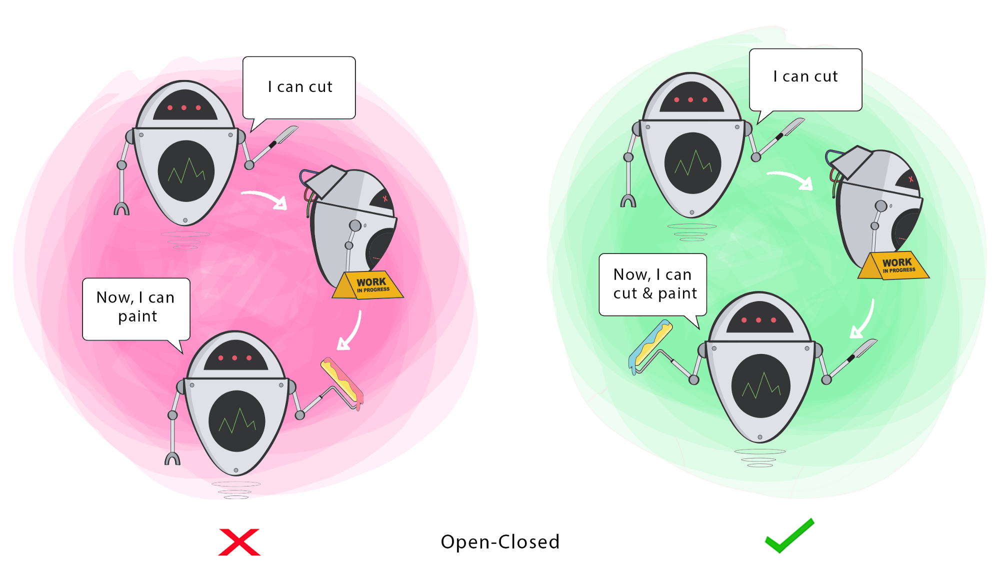

# Develop professionally with JavaScript

---

## Chapter 1 : Introduction

## Chapter 2 : Functions and functional aspects

## Chapter 3 : OOP in JavaScript

## Chapter 4 : ECMA 2015 and newer version

## Chapter 5 : The development process

## Chapter 6 : Testing JavaScript applications

## Chapter 7 : Advanced concepts in the object-oriented programming

## Chapter 8 : The design patterns of the Gang of Four

## Chapter 9 : Architectural patterns and concepts of modern JavaScript Web Frameworks

## Chapter 10 : Messaging

## Chapter 11 : Continuous Integration

---

## Chapter 1 : Introduction

Basic JavaScript syntax

---

## Chapter 2 : Functions and functional aspects

### Features of JavaScript functions

Functions are first-class objects in JavaScript. That means that they can be passed as arguments inside other arguments, they can be assigned to variables, returned from other functions etc. All functions have a name property that represents the name of the function, a length property that represents the number of defined arguments that it has and a prototype property that we'll talk about in chapter 3 when in comes to OOP in JavaScript.

In functions we can use, as well as we can in objects, the keyword ```this```. The keyword ```this``` is based on the context of the function. Example:

```JavaScript
const person = {
    firstName : "Max",
    getFirstName : function(){
        return this.firstName();
    }
}

console.log(person.getFirstName()); // Output : Max
```

In this case ```this``` is the object ```person```. ```this``` is always about the context. If we are not inside any object and use ```this``` on a function, ```this``` points out to the window object:

```JavaScript
getFirstName : function(){
    return this.firstName();
}

console.log(getFirstName()); // undefined
```

Here, we get 'undefined' since we don't have any property named firstName inside the object ```this``` where ```this``` is pointing to.

Functions also build a 'Function-Level-Scope' meaning that we have a defined visibility scope inside functions. Example:

```JavaScript
function example(x){
    if(x){
        var y = 4711;
    }
    for(var i = 0 ; i < 4711; i++){
        // Code
    }

    console.log(y); // 4711
    console.log(i); // 4711
}

example(true);
```

In our case we still get the values because they were defined inside the function level scope. This only works with ```var```, not with ```let```.

In many cases it's better to define all the variables at the beginning of the function. It's a good thing to define all of your variables at the start of the function since you can be sure that you don't repeat yourself. **Declaring all the variables at the start of a function, before using them, is called Variable Hoisting.**

```JavaScript
function example(x){
    var y, i;

    console.log(y);
    console.log(i);

    if(x){
        var y = 4711;
    }
    for(var i = 0 ; i < 4711; i++){
        // Code
    }
}
```

If you choose not to declare the visibility/behavior of your variable by not writing ```let```, ```var``` nor ```const``` before it, it will be seen as a global variable. This is a very bad practice because it can cause name conflicts and other bugs that are very hard to fix.

In JavaScript there is no such thing as proper function overloading. A 'best practice' when it comes to function overloading is setting up a 'config' variable that changes the output of the function. Example:

```JavaScript
function add(x, y, config){
    const result = x + y;
    if(config && config.log){
        console.log(result);
    }

    return result;
}

add(2, 2);
add(2, 2, {log : true});
```

### Standard Methods for JavaScript Functions

In JavaScript, as we said before the keyword ```this``` represents the context that a function is bound to.
All JavaScript functions have some standard functions. This functions are:

- bind
- call
- apply

#### bind

With bind, as well as with the other standard methods, we can change the context of the keyword ```this``` and get that function in return. Example:

```JavaScript
const button = {
    handler : null,
    onClick : function(handler){
        // handler is a callback-handler
        this.handler = handler;
    },
    click : function(){
        this.handler();
    }
}

const handler = {
    log : function(){
        console.log("Clicked on the button.");
    },
    handle : function(){
        this.log();
    }
}

// button.onClick(handler.handle); Wrong, since this points to button, not to handler
button.onClick(handler.handle.bind(handler));
button.click();
```

In this example you can see that if we choose to use ```button.onClick(handler.handle)``` we will get an error because we use ```this.log()``` inside the ```handler.handle``` function, but we use the ```handler.handle``` function inside another context. The context is not ```handler```, the context is ```button``` and since ```button``` doesn't have a function called ```log``` we will get an error. However, if we use the ```bind``` keyword, we can change the reference of ```this``` inside the when we pass ```handler.handle``` function inside the ```button.onClick``` function and we can change it to be ```handler``` since we have the function ```handler.log``` there, so we won't get an error and everything will work the way we want it to.

If we want to pass arguments with ```bind``` we can do it by inserting them as rest arguments:

```JavaScript
function.bind(thisArg)
function.bind(thisArg, arg1)
function.bind(thisArg, arg1, arg2)
function.bind(thisArg, arg1, ... , argN)
```

Bind doens't execute the function, it just returns a new function back with the given context. 

When creating a bound function, The bound function will get some extra arguments:

- ```[[TargetFunction]]```, which represents the function that you used the ```bind()``` keyword on.
- ```[[BoundThis]]``` which represents the ```this``` keyword.
- ```[[BoundArgs]]``` which represents the given arguments ( apart from the ```this``` keyword ) inside the ```.bind()``` method.

As previously mentioned, bind changed the ```this``` keyword of a function. **Even if it is applied multiple times, on multiple bound functions, it can only change the ```this``` keyword once:

```JavaScript
const f = function(){
    // code
    console.log(this);
}

const test_object_1 = { number : 1 };
const test_object_2 = { number : 2 };
const test_object_3 = { number : 3 };

const f_bind_1 = f.bind(this, 1, 2, 3);
const f_bind_2 = f_bind_1.bind(this, 4, 5, 6);
const f_bind_3 = f_bind_2.bind(this, 7, 8, 9);

f_bind_1();
f_bind_2();
f_bind_3();
```

In this example, even if the ```[[BoundThis]]``` property of each bound function will be updated to become the given ```this``` argument inside each ```.bind(this, ...args)``` function, when logging out ```this``` to the console, ```this``` won't be overriden by the other ```.bind()``` functions, and regardless of how many times we bind the bounded functions, it will always be the first given ```this``` argument, from the first ```bind()``` function ( in our case that would be ```test_object_1```. ).

#### call

Call, just like bind, changes the context, the function is bound to. That means that, as well as bind, it changes the meaning of the ```this``` keyword. Unlike ```bind```, call executes the function directly without giving you back a new function with a changed context. Example:

Let's say that you want to have a function that prints all the names it is given ( using the ```arguments``` property that every function has ).

```JavaScript
function printNames(){
    console.log(arguments);

    arguments.forEach((argument) => {
        console.log(argument);
    });
}
```

This will result into an error since the keyword ```arguments``` doesn't fully inherit all the methods of a list.
We can, however, take the ```forEach``` method from the ```Array.prototype``` and apply it to our list of arguments. **This is also known as Method Borrowing**.

```JavaScript
function printNames(){
    console.log(arguments);

    Array.prototype.forEach.call(arguments, function(argument){
        console.log(argument);
    });
}

printNames("a", "b");
```

#### apply

Apply is almost the same as call. The only difference between apply and call is that we have to give the list of arguments inside an array, not as rest parameters.

Example:

```JavaScript
function printNames(){
    Array.prototype.forEach.apply(arguments, [(argument) => {
        console.log(argument);
    }]);
}

printNames("a", "b");
```

#### using standard methods in variadic functions

Variadic functions are functions where the total numbers of parameters is unknown ( where we work with rest parameters ).

An example for a variadic function is ```Math.max()```:

```JavaScript
console.log(Math.max(1, 2)); // 2
console.log(Math.max(1, 2, 3)); // 3
console.log(Math.max(1, 2, 3, 4)); // 4
console.log(Math.max(1, 2, 3, 4, 5)); // 5
```

If we would have a list of numbers that we want to apply this function to, we can't just give the list as an argument. We can however, use apply, for example ( or add numbers as rest argument ):

```JavaScript
const numbers = [1, 2, 3, 4, 5];
// console.log(Math.max(numbers)); // WRONG
console.log(Math.max(...numbers)); // 5
console.log(Math.max.apply(null, numbers)); // 5
```

**It is considered a *best practice* to set the ```this``` argument to be ```null``` if it's not needed.**

### Characteristics of functional programming

In functional programming the focus is on functions, not on objects
Here are some principles & traits of functional programming:

- Functions are first-class objects meaning that they can be assigned to other variables, passed down as parameters inside other functions or be returned from other functions
- Data-Structures don't change in functional programming. Functions that are used on data structures create new data-structures but never change the original ones. In pure functional programming languages you can't change data-structures. You can't add or delete elements from a list for example. JavaScript is not a pure functional programming language.
- Functions in functional programming languages don't have any side-effects meaning that for the same input you will **always** get the same output.
- Functional programming is declarative. We focus on **what** the program does, we don't focus on the **how** the program does what it does.
- Functional programming languages usually take less space than imperative or object oriented programming languages.

### Differences between object oriented programming and functional programming

In object oriented programming, data and behavior are assembled into a structure called a 'class'. The behavior, so the methods of the class, work together with the data. In functional programming, the data is just bound to the function that you are using. That means that you can use functions with different types of data sturctures or you can use the same data structure with different functions.

In functional programming composition means that you compose easier functions to more complex ones.

### Differences between imperative programming and functional programming

In imperative programming you describe **how** you do what you do. In functional programming you describe **what** the result must be, you describe how to get to the result. Shortly said:

**Imperative programming is about how to get to the result while functional programming is about what the result is.**

In imperative programming you use for- and while- loops combined with if/else conditions and more while in functional programming you just describe what the result is.

### Differences between pure functional programming and functional programming in JavaScript

As we've discussed before, JavaScript is an impure programming language. We don't have homoiconicity, lazy evaluation ( lazy evaluation optimization ) or pattern matching, the way we have them in pure programming languages. Here is a short description of these terms:

- Homoiconicity means that the language itself is written as a data-structure that you can represent in that language. You can program the language itself.
- Lazy evaluation, delayed evalutaion or non-struct evaluation means that you don't evaluate what you never need to ( if the value isn't needed, don't run the expression ) and if the evaluation is done and we need the value twice, don't evaluate it the second time, just save the answer and use it again. Only call it if you need it. The opposite of lazy evaluation is strict / eager evaluation. Lazy evaluation reduces the amount of code that is executed and it also reduces the amount of memory that is used. You're separating **how** to generate the value ( the code that you write, that generates the value ) from **when or wether** you run it.
- Pattern matching allows you to mtach a value against some pattern to select a branch of code.

### From Imperative programming to functional programming

As we've already said, imperative programming has the focus on **how** we get to a result while functional programming has the focus on **what** the result is and should look like.

In this sub chapter I will describe a couple methods in the functional programming.

##### forEach

Instead of iterating with a for loop over an array, you can use a ```forEach``` loop:

```JavaScript
array.forEach((value, index, array) => {
    console.log(value);
});
```

##### map

If you want to get a new array from another array that has something changed to every element of it, you can use ```map```:

```JavaScript
const numbers = [1, 2, 3, 4, 5];
function power_of_2(number){
    return number**2;
}

const numbers_at_the_power_of_2 = numbers.map(
    (value, index, array) => {
        return power_of_2(value);
    }
);
```

##### filter

If you want to filter out values based on a function that returns ```true``` or ```false``` you can use the ```filter``` method:

```JavaScript
const numbers = [1, 2, 3, 4, 5, 6, 7, 8, 9, 10];
function number_under_5(number){
    return number < 5;
}

const number_under_5 = numbers.filter(
    (value, index, array) => {
        return number_under_5(value);
    }
);
```

##### reduce

You can also reduce a data structure to one single element by using the ```reduce``` method. Example:

```JavaScript
const numbers = [1, 2, 3, 4, 5, 6, 7, 8, 9, 10];

const sum_of_numbers = numbers.reduce(
    (previousValue, currentValue, currentIndex, array) => {
        return previousValue + currentValue;
    },
    0 // default previousValue
);
```

### Functional Techniques and Design Patterns

Before getting into functional techniques we should understand some basic terms.

#### Homoiconicity

Homoiconicity means "code as data" which signifies that hte language itself is written as a data-structure that you can represent in that language. You can prgoram the langauge itself. Homoiconicity is a property in which the program tructure is very similar to its syntax.

#### Lazy evaluation / Delayed evaluation / Non-struct evaluation

A programm that uses lazy evaluation doesn't evaluate what it never needs to. If you never need a value, don't run the expression that generates the valu eif you're never going to use it. Once you do evaluate it and you need it multiple times, don't evaluate it a seocnd time, just save the answer and use it again. So if you have an expression that returns a result, you either never run it, or you only run it once. This is called Lazy Evaluation Optimization. Yo don't run expression you don't need and if you do run them, you only run them once. 
The opposite of lazy evaluation is strict/eager evaluation.
Lazy evaluation reduces the amount of code that is executed & also the amount of memory that is used.

#### Higher order and unary functions.

A higher order function is a function that either takes a function as a parameter, returns a function or both.
An unary function is a function that only takes in one parameter.

#### Memory allocation, Call stack and Heap

Fully grasping the concept of memory management plays a big role in understanding certain things in functional programming and in programming in general.
After we compile a program the memory is split into 4 pieces : machine code, static memory, call stack and heap.


The program is compiled into **machine code** ( that is 1's and 0's ).
**Static Memory** persists throughout the entire life of the program and is usually used to store things like global variables.

In order to understand the call stack let's take a look at the following example in C#:

```cs
static void Main(string[] args)
{
    Console.WriteLine("Inside the main function.");
    int mainFunction_variable_1 = 1;
    int mainFunction_variable_2 = 2;

    firstFunction();
}
static void firstFunction()
{
    Console.WriteLine("Entering the first function.");
    int firstFunction_variable_1 = 3;
    int firstFunction_variable_2 = 4;

    secondFunction();
}
static void secondFunction()
{
    Console.WriteLine("Entering the second function.");
    int secondFunction_variable_1 = 5;
    int secondFunction_variable_2 = 6;

    thirdFunction();
}
static void thirdFunction()
{
    Console.WriteLine("Entering the third function.");
    int thirdFunction_variable_1 = 7;
    int thirdFunction_variable_2 = 8;
}

/*
Output:

Inside the main function.
Entering the first function.
Entering the second function.
Entering the third function.
*/
```

The call stack is built out of **stack frames**. A **stack frame** is the scope of a currently running function. The call stack in C# for example always starts with the method ```main()``` since every C# program needs that method in order to run. 
When the program starts, the method main starts as well, that means that we add a stack frame to the call stack. When we get to the line of code that executes ```firstFunction()```, we add another stack frame on top of the ```main()``` stack frame since we called another function inside the main function. During this time the stack frame ```main()``` doesn't delete itself, it just stays at the bottom. 
Inside the ```firstFunction()``` we've called the ```secondFunction()``` which means that we'll add another stack frame on top of the stack frame ```firstFunction()```. Inside the ```secondFunction()``` we've called the ```thirdFunction()``` which means that we'll add another stack frame on top of the stack frame ```secondFunction()```.
Stack frames are just functions that are called inside other functions that are called inside other functions and so on, until we get to the bottom of the application. 
The call stack is a LIFO ( Last in first out ) data structure, hence the name **stack**.
Here is an illustration:


After the ```thirdFunction()``` is done executing, its stack frame will be delete from the stack and we'll go back to the ```secondFunction()``` and so on.

Here is the call stack once we get to the ```thirdFunction()```. You can see that the arrow points to the top of the call stack.


This is how the call stack looks like once the ```thirdFunction()``` stops executing:


You can see that the stack frame has been deleted from the call stack.
This is how the call stack will look in the end after even the ```firstFunction()``` will stop executing and we'll be at the end of the program waiting for the ```main()``` function to stop so we can then close the program.


Each stack frame has its own local scope with its own variables that, if not stored somewhere or returned from the frame before the stop of the execution are deleted with the stack frame. The **heap** unlike the **call stack** isn't structured and it stores reference values like objects. Since the machine code can't directly get to the objects on the heap, we assign pointers on stack frames to those objects so we can work with them. 

Here is an example in c# with the functions from before:

```cs
static void Main(string[] args)
{
    Console.WriteLine("Inside the main function.");
    int mainFunction_variable_1 = 1;
    int mainFunction_variable_2 = 2;

    firstFunction();
}
static void firstFunction()
{
    Console.WriteLine("Entering the first function.");
    int firstFunction_variable_1 = 3;
    int firstFunction_variable_2 = 4;

    Person person = new Person("testName", 18);

    secondFunction();
}
static void secondFunction()
{
    Console.WriteLine("Entering the second function.");
    int secondFunction_variable_1 = 5;
    int secondFunction_variable_2 = 6;

    thirdFunction();
}
static void thirdFunction()
{
    Console.WriteLine("Entering the third function.");
    int thirdFunction_variable_1 = 7;
    int thirdFunction_variable_2 = 8;
}
```

Let's look at some snapshots of the memory inside the ```firstFunction()``` stack frame and see how the heap has changed. Here is a snapshot of the heap inside the ```main()``` callstack before calling the ```firstFunction()``` and adding another stack frame on top of the ```main()``` stack frame.


You can see that the heap only has some preloaded objects on it that come with every console application.
Now let's make another snapshot of the memory inside the ```firstFunction()``` stack frame after the instantiation of the person object but also before getting inside the ```secondFunction()``` stack frame.

If we look inside the snapshot of the second frame on the call stack we can see that it still has the same preloaded objects but also the object Person:


Visual studio also helps us see all the instances of the class Person including their addresses on the heap:


Now if we continue the program we will call the function ```secondFunction()``` which would add another stack frame with the scope of ```secondFunction()``` on the call stack. We can see that the object Person that we've created on the second stack frame inside ```firstFunction()``` will still be there, not only in the ```secondFunction()``` stack frame but also in the ```thirdFunction()``` stack frame.


Once we reach the end of the ```thirdFunction()``` method, its stack frame will be deleted, then we'll have to go back to the ```secondFunction()``` method where its stack frame will be deleted and so on until we reach the main stack frame. If we take another snapshot of the memory inside the stack frame of the main function we'll see that the Person object has been deleted once the method ```firstFunction()``` stopped executing and its stack frame got popped out of the call stack. The object Person has been taken out by the garbage collector.


So as a recap:
Memory is split in 4 sections: machine code ( m.c ), static memory, call stack and heap.
Machine code is just 0's and 1's that the computer can understand.
Static memory are global values that exist everywhere and persist throughout the program.
The call stack always begins with the ```main()``` function and every function that is executed inside it adds a stack frame on top of the main stack frame. Every function that is called inside that function also adds another stack frame with its scope on top of that function's stack frame.
The heap contains references values. This values have a certain unique hexadecimal address where they are stored. Pointers are created on seperate stack frames that can point to that certain object on the heap. Once a stack frame with the last pointer of a certain object is getting popped out of the call stack, the garbage collector deletes the object from the heap to eliberate more memory.


In JavaScript however, we don't have a main stack frame, we don't have the ```main``` function where everything starts. We just start writing code wherever we want in the script. 
In JavaScript, we have the so called, ```global context```. Take a look at the following example:

```JavaScript
const firstFunction = () => {
    console.log("Inside the first function.");
    secondFunction();
}

const secondFunction = () => {
    console.log("Inside the second function.");
    thirdFunction();
}

const thirdFunction = () => {
    console.log("Iniside the third funciton.");
}

firstFunction();
```

The function ```firstFunction()``` is called inside the ```global context```, if we debug this application in chrome up to the ```thirdFunction()``` stack frame you will see that the main stack frame of javascript is called ```anonymous``` ( also ```main``` in some other browsers ).


Another thing that you have to pay attention to is threading. When using threading, the only thing that splits up is the call stack, the heap is never split up between multiple threads. So if multiple threads access an object, they are all accessing the same exact object. This could lead to dead locks in certain cases that might be hard to debug.


#### Function composition and function piping

Function composition is exactly like the mathematical function composition. You have for example 2 functions, and you want to combine them into one function that can work with the future inputs. It's the same thing in JS. 

Example of function composition:

```JavaScript
const add2 = (x) => x + 2;
const subtract1 = (x) => x - 1;
const multiplyBy5 = (x) => x * 5;

console.log(multiplyBy5(subtract1(add2(4)))); // Output : 25
```

This is not a real example of composition in a real js project since we always have to manually give the functions that we want to compose. What you have to understand from this example is that functions in composition go from the inside to the outside. First we execute the ```add2```, then ```subtract1``` and then, in the end, the ```multiplyBy5```. So we have ```(4 + 2 - 1) * 5``` which equals ```25```.

Normally, we would have a function that receives the callback functions that we want to compose as an argument and then returns a function that takes in multiple arguments that will be passed in to the accumulated composed function. Example:

```JavaScript
const compose = (...callbackFunctions) => {
    return function(...compositionValues){
        return callbackFunctions.reduceRight(
            (accumulator, currentCallback, currentIndex, callbackFunctionsArray) => Array.isArray(accumulator) ? currentCallback(...accumulator) : currentCallback(accumulator),
            compositionValues
        )
    }
}
```

While **functiom composition** goes from the inside to the outside ( right to left ), **function piping** goes from the outside the inside ( left to right ). Example:


```JavaScript
const pipe = (...callbackFunctions) => {
    return function(...compositionValues){
        return callbackFunctions.reduce(
            (accumulator, currentCallback, currentIndex, callbackFunctionsArray) => Array.isArray(accumulator) ? currentCallback(...accumulator) : currentCallback(accumulator),
            compositionValues
        )
    }
}
```


#### Let, Const and Var

Before learning the difference between let, const and var let's talk about what a block scope is. A block scope is the space that we have between curly braces (```{}```) where we write our code in.

Example:
```JavaScript
function(){
    // This is a scope

    if(true){
        // This is another scope
    }
}
```

```let``` is a statement which defines variables inside the local block scope. That means that the variables are only visible **inside the block scope their were defined in and inside all the other sub-scopes**.

```JavaScript
if(true){
    let i = 5;
}

console.log(i); // ReferenceErrror
```

Here, we are getting a reference error since the scope of i ends inside the if statement. ```i``` is only defined inside the scope of the ```if``` statement:


```let``` is only visible inside the block scoped it was defined in and all the other sub-scopes.

```JavaScript
if(true){
    let i = 5;
    console.log(i); // 5

    if(true){
        console.log(i); // 5
    }
}
```

You can always create a block scope when you need it by just adding curly braces to your code.

```JavaScript
// Global scope
{
    // A local block scope that we created with curly braces
    let i = 5;
}

console.log(i);
```

Now let's talk about ```var```. The ```statement``` declares a variable inside the function scope. While ```let``` is only about ```block scope```, ```var``` is about ```function scope```. 

```JavaScript
function test(){
    var i = 5;
}

console.log(i); // ReferenceError
test();
console.log(i); // ReferenceError
```

The scope of a variable declared with ```var``` is either the enclosing function and all functions declared withing it or, if the variable is not decalred inside any function, the variable will be **global**.

```JavaScript
if(true){
    var i = 5;
    let c = 10;
}
var j = 15;

function test(){
    console.log(j);
    console.log(c);
}

console.log(j);
test(); // console.log -- > 15, 5, ReferenceError ( because of c )
```

You can see in this example that c was declared using ```let```, so its scope was only insied the ```if``` statement while the other 2 variables were declared using ```var``` and because they weren't inside any function, their scope was global.

Now let's talk about the **Temporal Dead Zone ( TDZ )**. Variables that are declared with ```let``` can't be written or read before initialization ( that means that they also need a value ). All variables declared with ```var``` however, are hoisted internally by javascript at the start of their scope, meaning that they will get the default value of ```undefined```.

```JavaScript
{
    console.log(j); // undefined
    console.log(i); // ReferenceError

    let i = 5;
    var j = 10;
}
```

The variable ```i``` was declared with ```let``` and the variable ```j``` was declared using ```var```. Since all variables declared with ```var``` are hoisited internally by javascript at the top of any function they receive the default value of ```undefined``` while the variables declared using ```let``` can't be read nor written before initialization. Variables declared with ```const``` behave the same as ```let``` but they must have constant values ( meaning that their values can't change )

#### Closures

A closure is the combination between a function and its lexical scope. The lexical scope is the function's accessible scope around it. The **lexical scope** or the **lexical environment** is the accessible ```scope```.

Example:

```JavaScript
var GLOBAL_VARIABLE = "hello world";

function test(){
    const i = 5;
    const j = 10;
    let z = 15;

    return () => {
        console.log(i);
        console.log(j);
        console.log(z);

        let x = 20;
        console.log(x);
        console.log(GLOBAL_VARIABLE);
    }
}

function init(){
    const closure = test();
    closure(); // output : 5, 10, 15; 20; "hello world"
}
init();
```

In this case the lexical scope of the returned function was the scope of the outside function ```test()``` which included the 3 local variables ```i```, ```j``` and ```z``` but also the global scope which included one variable called the ```GLOBAL_VARIABLE```.

You can see that even if the ```test()``` stack frame has been popped of the call stack after its execution at ```const closure = test()```, the returned function still has access to its scope.

With closures, we also have the **Closure Scope Chain**. Each closure in JavaScript has 3 scopes:

* Own scope
* Outer functions' scope
* Global scope


I have written Outer **functions'** scope" because as we've previously seen in the ```let, var and const``` section, the scope of variables declared with ```let``` or ```var``` are block scoped ( ```var``` is not only block scoped but also function scoped ). That means that the lexical environemnt ( which is the **accessible scope** ) extends itself over multiple outer functions:

```JavaScript
const test = () => {
    let i = 5;

    return test_2 = () => {
        let j = 10;

        return test_3 = () => {
            let x = 15;

            return test_4 = () => {
                console.log(i);
                console.log(j);
                console.log(x);
            }
        }
    }
}

const x = test();
x()()();
```

The closure ```test_4``` has access to all the variables outside all the outer functions. Its lexical environement extends itself over multiple functions.

All JavaScript functions are actually closures, even when you define a function that is not an inner function, the ```outer functions' scope``` is just the scope of the main stack frame, the ```global scope```. Just because the ```outer functions' scope``` and the ```global scope``` coincide doesn't mean that the defined function is not a scope:

```JavaScript
let i = 5;

function test(){
    console.log("This is my inner scope");
    console.log("Accessing a variable from the outer scope...");
    console.log(i);
}

test();
```

In this case, even the function ```test()``` is a closure, since it is a function combined with a lexical environment.


In this case the ```outer function scope``` and the ```global scope``` coincide. In JavaScript, as previously explained in the section with the ```call stack```, we are kind of always inside a function since the stack frame starts with the ```anonymous function```, so the ```global scope``` is a function, but when talking about closures that are actual inner functions, we sepearte these terms to make things more clearly, since in that case the ```global scope``` can be accessed by all functions that are created while the ```outer functions' scope``` can only be accessed by the inner function returned.

You can also see all the scopes of a closure if you ```dir``` it inside the console:

```JavaScript
const someFunction = () => {
    let i = 5;
    let j = 10;

    return () => {
        let x = 15;

        console.log(i);
        console.log(j);
        console.log(z);
    }
}

const result = someFunction();
console.dir(result);
```


As previously explained we have 3 scopes but the ```closure``` scope referes to the ```outer functions' scope``` that we've talked about.

#### Partial Application

Sometimes you might not want to directly execute a function with all the arguments that it needs, since maybe it you don't have all the needed arguments yet. You can solve problems like this using partial application. With partial applications you can preserves certain arguments inside a returned closure and execute that closure with other arguments whenever you want. Example:

```JavaScript
function partial(aFunction /*, the rest of the arguments */){
    const parametersBound = Array.prototype.slice.call(arguments, 1);
    return function(){
        const parametersUnbound = Array.prototype.slice.call(arguments, 0);
        return aFunction.apply(
            this,
            parametersBound.concat(parametersUnbound)
        );
    }
}

const add = (...args) => {
    let sum = 0;
    for(let i = 0 ; i < args.length ; i++ ){
        sum += args[i];
    }

    return sum;
}
j
const partialAdd = partial(add, 1, 2);
console.log(partialAdd(3)); // 1 + 2 + 3 = 6
```

Partial applications don't have to be split up in 2, it's not a rule:

```JavaScript
function partialAdd(number1, number2){
    return function(number3, number4, number5){
        return function(number6, number7, number8, number9){
            return function(number10){
                return number1 + number2 + number3 + number4 + number5 + number6 + number7 + number8 + number9 + number10;
            }
        }
    }
}
```

The ```outer functions' scope``` of the last closure extends itself up to the definition of the function ```partialAdd``` due to closures. The depth of a nested function doesn't play any role in closures.

#### Currying

Currying is very similar to partial application. Look at the following example:

```JavaScript
function add(x, y){
    return x + y;
}

const result = add(1, 2); // 3
```

If we want to curry the function add we can return a closure with the first number in it's outer scope:

```JavaScript
function add(x){
    return function(y){
        return x + y;
    }
}
```

To make it easier to see we can use arrow functions:

```JavaScript
const add = x => y => x + y;
```

Now let's say that we want to have a function that adds up three numbers:

```JavaScript
const add = x => y => z => x + y + z;
``` 

This is currying, it's very similar to partial applications. Here is the difference:

Currying: A function returning another function that might return another function, but every returned function must take only one parameter at a time.

Partial application: A function returning another function that might return another function, but each returned function can take several parameters.

Currying might or might not return another function but it will always required **only one parameter**. A partial application might or might not return another function but it might require **one or more parameters**.

#### IIFE ( Immediately Invoked Function Expression ) || SEAF ( Self-Executing Anonymous Function )

An IIFE is a function with no name that executes itself:

```JavaScript
(
    () => {
        // Your code in here
    }
)();
```

It is used for modules, to build scopes and it's also good to use ```async``` ( see Promises, later chapter ) on an anonymous function that instantly executes itself.

#### Self-defining Functions

Self-defining functions are functions that re-define themselves internally

```JavaScript
function printOneThenPrintTwo(){
    console.log(1);

    printOneThenPrintTwo = function(){
        console.log(2);
    }
}

printOneThenPrintTwo();
printOneThenPrintTwo();

// Output : 1, 2
```

#### Promises, Async/Await, Synchronous and Asynchronous tasks

Before getting into synchronous and asynchronous tasks, we must first understand what a task is and what the difference between threads, processes and tasks is.

**A process contains multiple threads. A thread contains multiple workers. A worker must finish multiple tasks. The way a worker executes those tasks can be synchronous or asynchronous.**

Here is an overview:


You can see that each worker has 3 tasks. Tasks can be executed synchronously or asynchronously ( sync or async ).
Synchronous means that a task must be fully finished before the worker can start working on the next task. Asynchronous means that a task can start whenever it needs to start and it doesn't have to wait for any task to start or finish before starting:


Let's take a look at the following JS code:

```JavaScript
const firstFunction = () => {
    console.log("The execution of the first function has started.");
    setTimeout(
        () => {
            console.log("The execution of the first function has stopped.");
        },
        2000
    );
}

const secondFunction = () => {
    console.log("The execution of the second function has started.");
    console.log("The execution of the second function has stopped.");
}

firstFunction();
secondFunction();
/*
Inside console:

The execution of the first function has started.
The execution of the second function has started.
The execution of the second function has stopped.
The execution of the first function has stopped.
*/
```

The function ```setTimeout``` is an asynchronous function, that means that it won't wait for anything and it will just execute when it's time to execute.
If we want to have the ```firstFunction``` and the ```secondFunction``` executed in order we must call the ```secondFunction``` at the end of the ```setTimeout``` function inside the ```firstFunction```.

```JavaScript
const firstFunction = () => {
    console.log("The execution of the first function has started.");
    setTimeout(
        () => {
            console.log("The execution of the first function has stopped.");

            secondFunction();
        },
        2000
    );
}

const secondFunction = () => {
    console.log("The execution of the second function has started.");
    console.log("The execution of the second function has stopped.");
}

firstFunction();
/*
Inside the console:

The execution of the first function has started.
The execution of the first function has stopped.
The execution of the second function has started.
The execution of the second function has stopped.
*/
```

This solves our problem. But there is another problem now. First of all, it is very hard to read the code since we don't exactly know that the ```secondFunction``` starts inside the ```firstFunction```, that is not clear when we start the ```firstFunction``` and we look at the code for the first time. So the code is hard to read. Another problem is if we try to add more steps to our code:

```JavaScript
const firstFunction = () => {
    console.log("The execution of the first function has started.");
    setTimeout(
        () => {
            console.log("The execution of the first function has stopped.");
            secondFunction();
        },
        2000
    );
}

const secondFunction = () => {
    console.log("The execution of the second function has started.");
    console.log("The execution of the second function has stopped.");
    thirdFunction();
}

const thirdFunction = () => {
    console.log("The execution of the third function has started.");
    setTimeout(
        () => {
            console.log("The execution of the third function has ended.");
            fourthFunction();
        },
        3000
    );
}

const fourthFunction = () => {
    console.log("The execution of the fourth function has started.");
    console.log("The execution of the fourth function has stopped.");
}

firstFunction();

/*

Inside the console:

The execution of the first function has started.
The execution of the first function has stopped.
The execution of the second function has started.
The execution of the second function has stopped.
The execution of the third function has started.
The execution of the third function has ended.
The execution of the fourth function has started.
The execution of the fourth function has stopped.
*/
```

The code works but is very hard to read and bugs would be very hard to solve using this code. Here is how the code would look like if we would use only callbacks:

```JavaScript
const firstFunction = () => {
    console.log("The execution of the first function has started.");
    setTimeout(
        () => {
            console.log("The execution of the first function has stopped.");

            setTimeout(
                () => {
                    console.log("The execution of the second function has started.");
                    console.log("The execution of the second function has stopped.");

                    setTimeout(
                        () => {
                            console.log("The execution of the third function has started.");
                            setTimeout(
                                () => {
                                    console.log("The execution of the third function has ended.");

                                    setTimeout(
                                        () => {
                                            console.log("The execution of the fourth function has started.");
                                            console.log("The execution of the fourth function has stopped.");
                                        },
                                        0
                                    );
                                },
                                3000
                            );
                        },
                        0
                    );
                },
                0
            );
        },
        2000
    );
}

firstFunction();
/*
Inside console:

Same output, the only difference is that we are only using callbacks.
*/
```

You can see that the code is shaped like a pyramid. This is also called **callback hell** or **the pyramid of doom**.

You can solve this problem with **promises**.

##### Promises

A promise in JavaScript is like a promise in real life. A promise works as placeholder for a future value. A Promise in JS can always be in one of the following states:

1. Pending
2. Fulfilled
3. Rejected

When a promise is pending that means that it is still waiting for a value.
When a promise is fulfilled that means that it is has the value it has been waiting for.
When a promise is rejected that means that it contains the error that occurred while trying to get to the value.

When a promise is either **fulfilled** ***or*** **rejected** that promise is also called ***settled***.
The state of the promise can only change from pending to either fulfilled or rejected. A Promise can't change states once it is settled. The same goes for the result/error of the promise. The promise can only have one result and one reuslt only and it can never change. The result of a promise can never change once it has been given one. The same goes for the error. The error of a promise can never cahnge once it has been given one.
Every promise takes in one parameter. That parameter is called the executor. The executor is a callback function that gets as arguments 2 callback functions: ```resolve``` and ```reject```. The executor function is written by the user but it gets executed in the promise with those 2 callback functions ```resolve``` and ```reject```. When the executor calls ```resolve```, it must give as an argument the result of the promise. The state of the promise will then be changed to ```fulfilled```. When the executor calls ```reject```, it must give as an argument the error of the promise. The state of the promise will then be changed to ```rejected```.
So, again:

When the callback function ```resolve``` is used inside the executor that means that the promsie has received the value we were waiting for. The state of the promise will be changed from PENDINg to FULFILLED. The value passed in to the reuslt callback inside the executor will also be the result of the funciton. When the callback function reject is used inside the executor callback that means taht the promise couldn't fulfill and it got an error. The state of the romise will then cahnge from PENDING to REJECTED. The error passed in to reject callback will also be the error of the promise. 

In order to use the result or the error of a promise you need to use ```.then```. 
The method ```.then``` takes in 2 callbacks : ```onfulfilled_callback``` and ```onrejected_callback```. One of those callbacks will be executed once the promise is settled. 
The method ```.catch``` takes in 1 callback : ```onrejected_callback``` and calls ```.then(null, rejected_callback)``` internally.
The method ```.finally``` takes in 1 callback and will always be called at the end, no matter the state of the settled promise.

It is important to know that the executor of a promise ( the argument that is given to a promise's constructor ) is always execute synchronously. We'll see later how to solve that problem ( using async/await ).

Here is how a custom promise would look like ( it doesn't implement all the futures of a normal promise, it's just a prototype ):

```JavaScript
'use strict';

class CustomPromise{
    constructor(executor){
        /*
        A Promise can be in one of the following states:

        1. PENDING, meaning that the promise is still waiting for a result
        2. FULFILLED, meaning that the promise has a result
        3. REJECTED, meaning that the promise contains the error that occurred while trying to get the result
        */
        this.POSSIBLE_PROMISE_STATES = {};
        Object.defineProperties(
            this.POSSIBLE_PROMISE_STATES,
            {
                "PENDING" : {
                    value : 0,
                    writable : false,
                    enumerable : true,
                    configurable : false
                },
                "FULFILLED" : {
                    value : 1,
                    writable : false,
                    enumerable : true,
                    configurable : false
                },
                "REJECTED" : {
                    value : 2,
                    writable : false,
                    enumerable : true,
                    configurable : false
                }
            }
        );

        // The promise always starts in pending mode
        this.CURRENT_PROMISE_STATE = this.POSSIBLE_PROMISE_STATES.PENDING;

        // In the following variables we will store the result or the error of the promise
        this.PROMISE_RESULT = null;
        this.PROMISE_ERROR = null;

        // In the following array we will store all the callbacks that needed the result of the value in order to execute while the promise was pending
        this.onfulfilled_callbacks = [];

        // In the following array we will store al lthe callbacks that needed the error of the value in order to execute while the promise was pending
        this.onrejecte_callbacks = [];

        // Execute the executor and pass in the resolve and reject methods as its arguments
        executor(this.resolve.bind(this), this.reject.bind(this));
    }
    resolve(EXECUTOR_PROMISE_RESULT){
        // Since the promise can only have one result, we'll check if the promise is already fulfilled. If the promise is already fulfilled then the given result will be ignored.
        if(this.CURRENT_PROMISE_STATE === this.POSSIBLE_PROMISE_STATES.FULFILLED) return;

        // Change the state of the promise to fulfilled since we now have the result of the promise
        this.CURRENT_PROMISE_STATE = this.POSSIBLE_PROMISE_STATES.FULFILLED;

        // Save the result of the promise
        this.PROMISE_RESULT = EXECUTOR_PROMISE_RESULT;

        // Execute all the callbacks that have been waiting for the result of the promise while the promise was still pending.
        this.onfulfilled_callbacks.forEach(callback => callback(this.PROMISE_RESULT));
    }
    reject(EXECUTOR_PROMISE_ERROR){
        // Since the promise can only ahve one error, we'll check if the promise is already rejected. If the promise is already rejecte d then the given error will be ignored.
        if(this.CURRENT_PROMISE_STATE === this.POSSIBLE_PROMISE_STATES.REJECTED) return;

        // Change the state of the promise to rejected since we now have the error of the promise
        this.CURRENT_PROMISE_STATE = this.POSSIBLE_PROMISE_STATES.REJECTED;

        // Save the error of the promise
        this.PROMISE_ERROR = EXECUTOR_PROMISE_ERROR;

        // Execute all the callbacks that have been waiting for the error of the promise while the promise was still pending.
        this.onrejecte_callbacks.forEach(callback => callback(this.PROMISE_ERROR));
    }
    then(resolve_callback, reject_callback){
        // Check the state of the promise. If the promise has been fulfilled, execute the resolve_callback argument with the result of the promise. If the promise has been rejected, execute the reject_callback argument with the error of the promise. If the promise is still pending then push both callbacks in the arrays that contain callbacks for onfulfilled and onrejected events.

        switch(this.CURRENT_PROMISE_STATE){
            case this.POSSIBLE_PROMISE_STATES.PENDING:
                if(resolve_callback !== null){
                    this.onfulfilled_callbacks.push(resolve_callback);
                }
                if(reject_callback !== null){
                    this.onrejecte_callbacks.push(reject_callback);
                }

                break;
            case this.POSSIBLE_PROMISE_STATES.FULFILLED:
                resolve_callback(this.PROMISE_RESULT);

                break;
            case this.POSSIBLE_PROMISE_STATES.REJECTED:
                reject_callback(this.PROMISE_ERROR);

                break;
        }
    }
    catch(reject_callback){
        this.then(null, reject_callback);
    }
}

const testExecutor = (resolve, reject) => {
    setTimeout(
        () => {
            resolve("This is the result of the promise");
        },
        2000
    );
}

const promise = new CustomPromise(testExecutor);

promise
    .then(
        (promiseResult) => {
            console.log(`The result of the promise is -- > ${promiseResult}`);
        }
    );
```

Here is how to build a normal promise:

```JavaScript
const promise = new Promise(
    (resolve, reject) => {
        setTimeout(
            () => {
                resolve(25);
            },
            2000
        )
    }
);

promise
    .then(
        result => console.log(`The result of the promise is -- > ${result}`)
    )
    .catch(
        error => console.log(`The error of the promise is -- > ${error.message}`)
    )
    .finally(
        () => console.log("This will always be executed, no matter the state of the settled promise")
    )

/*
In console:

The result of the promise is -- > 25
This will always be executed, no matter the state of the settled promise
*/
```

There is more to promises than this.

***The method ```Promise.then``` always returns a promise***:
If the handler function ( which is the function executed by ```.then``` or ```.catch``` [ which internally calls ```.then``` anyways ] regardless of the state of the settled promise ):

1. returns a value, the ```.then``` method will return a resolved promise with the given value as the result of the returned promise.
2. doesn't return anything, the promise returned by ```.then``` will be resolve with the result of ```undefined```.
3. throws an error, the promise returned by ```.then``` will be rejected with the given error.
4. returns a fulfilled promise, then the value returned by ```.then``` will be a fulfilled promise with the result of the returned fulfilled promise.
5. returns a rejected promise, then the value returned by ```.then``` will be a rejected promise with the error of the return rejected promise.
6. returns a pending promise, then the value returned by ```.then``` will return a promise which will be subsequent to the result/error of the returned pending promise.

Here is the list from https://developer.mozilla.org/en-US/docs/Web/JavaScript/Reference/Global_Objects/Promise/then, better explained and their diagram:

* returns a value, the promise returned by then gets resolved with the returned value as its value.
* doesn't return anything, the promise returned by then gets resolved with an undefined value.
* throws an error, the promise returned by then gets rejected with the thrown error as its value.
* returns an already fulfilled promise, the promise returned by then gets fulfilled with that promise's value as its value.
* returns an already rejected promise, the promise returned by then gets rejected with that promise's value as its value.
* returns another pending promise object, the resolution/rejection of the promise returned by then will be subsequent to the resolution/rejection of the promise returned by the handler. Also, the resolved value of the promise returned by then will be the same as the resolved value of the promise returned by the handler.


Here is an example:

```JavaScript
const promise = new Promise(
    (resolve, reject) => {
        setTimeout(
            () => {
                resolve(25);
            },
            2000
        );
    }
);

promise
    .then(
        (result) => {
            console.log(result);

            return 50;
        }
    )
    .then(
        (result) => {
            console.log(result);

            return 75;
        }
    )
    .then(
        (result) => {
            console.log(result);

            return 100;
        }
    )
    .then(
        (result) => {
            console.log(result);
        }
    );

/*
In console:

25,
50,
75,
100
*/
```

```Promise.resolve(value)``` will return a resolved promise with the given value as the result of the promise.
```Promise.reject(reason)``` will return a rejected promsie with the given error/reason as the error of the promise.

Take the following template as a starting point for the next methods on promises:

```JavaScript
const promise1 = Promise.resolve(25);
const promise2 = Promise.reject(new Error("Error 1"));
const promise3 = new Promise(
    (resolve, _) => {
        setTimeout(
            () => {
                resolve(50);
            },
            2000
        );
    }
);
const promise4 = new Promise(
    (_, reject) => {
        setTimeout(
            () => {
                reject(new Error("Error 2"));
            },
            2000
        );
    }
);

const promises = [promise1, promise2, promise3, promise4];
const fulfilling_promises = [promise1, promise3];
const rejecting_promises = [promise2, promise4];
```

```Promise.all()``` takes in an iterable of promises and returns a promise. The promise resolves into an array containing all the results of the promises. If one of the promises gets rejected, then ```Promise.all()``` will return a rejected promise with the error being the error of the first promise that rejected in the given array of promises

Web MDN explanation:

> The Promise.all() method takes an iterable of promises as an input, and returns a single Promise that resolves to an array of the results of the input promises. This returned promise will resolve when all of the input's promises have resolved, or if the input iterable contains no promises. It rejects immediately upon any of the input promises rejecting or non-promises throwing an error, and will reject with this first rejection message / error.

Example:

```JavaScript
Promise.all(promises)
    .then(
        results => results.forEach(result => console.log(result))
    )
    .catch(
        error => console.log(error.message)
    );

// In console: Error 1
```

```Promise.allSettled()``` takes in an iterable of promises and returns an array with objects that contain data about the settled promises. Each object contains the ```status``` property, that can be either ```fulfilled``` or ```rejected```. If the status is ```fulfilled``` the object will also contain a ```value``` property which will contain the result of the fulfilled promise. If the status is ```rejected``` the object will also contain a ```reason``` property which will contain the error of the rejected promise.

Web MDN explanation:

> The Promise.allSettled() method returns a promise that resolves after all of the given promises have either fulfilled or rejected, with an array of objects that each describes the outcome of each promise. It is typically used when you have multiple asynchronous tasks that are not dependent on one another to complete successfully, or you'd always like to know the result of each promise.In comparison, the Promise returned by Promise.all() may be more appropriate if the tasks are dependent on each other / if you'd like to immediately reject upon any of them rejecting.

Example:

```JavaScript
Promise.allSettled(promises)
    .then(results => results.forEach(
        result => {
            console.log(result.status);
            console.log(result.status === 'fulfilled' ? result.value : result.reason);
            console.log("-".repeat(25));
        }
    ));

/*
In console:

fulfilled
25
-------------------------
rejected
Error: Error 1
-------------------------
fulfilled
50
-------------------------
rejected
Error: Error 2
-------------------------
*/
```

```Promise.any()``` takes in an iterable of promises. It returns a resolved promise as soon as one of the promises in the iterable of promises resolves with the result of the first fulfilled promise. If all promises of the array are rejected, it returns a rejected promise containing an ```AggregateError```, which is a subclass of ```Error``` that contains all the errors of each promise passed in the iterable of promises. The ```AggregateError``` contains a property called ```errors``` that is an array containing all the errors of each rejected promise.

Web MDN Explanation:

> Promise.any() takes an iterable of Promise objects. It returns a single promise that resolves as soon as any of the promises in the iterable fulfills, with the value of the fulfilled promise. If no promises in the iterable fulfill (if all of the given promises are rejected), then the returned promise is rejected with an AggregateError, a new subclass of Error that groups together individual errors.

Example:

```JavaScript
Promise.any(rejecting_promises)
    .then(result => console.log(result))
    .catch(aggregateError => aggregateError.errors.forEach(error => console.log(error.message)));

/*
In console:

Error 1
Error 2
*/
```

```Promise.race()``` takes in an interable of promises and returns a resolved or rejected promise as soon as a promise from the given iterable settles with the result or error of the first settled promise

Web MDN Explanation:

> The Promise.race() method returns a promise that fulfills or rejects as soon as one of the promises in an iterable fulfills or rejects, with the value or reason from that promise.

Example:

```JavaScript
Promise.race(promises)
    .then(result => console.log(result))
    .catch(error => console.log(error));

/*
In console:

25
*/
```

##### Async/Await

Async and await is syntactical sugar for promises. It lets you write promises in a cleaner way and you don't have to configure promise chains anymore by yourself.

Web MDN Explanation:

> An async function is a function declared with the async keyword, and the await keyword is permitted within them. The async and await keywords enable asynchronous, promise-based behavior to be written in a cleaner style, avoiding the need to explicitly configure promise chains.

Instead of using ```.then()``` on a promise, you can use ```await```. The ```await``` keyword can only be used inside ```async``` functions. ```async``` functions will always return a promise.

Here is an example:

```JavaScript
async function testAsync(){
    return 5;
}

(
    async () => {
        const result = await testAsync();
    }
)();
```

This is the same as writing:

```JavaScript
const promise = Promise.resolve(5);
promise.then(result => console.log(result));
```

Here is an example using the ```fetch``` API:

```JavaScript
(
    async () => {
        const response = await fetch("https://jsonplaceholder.typicode.com/users");
        const result = await response.json();

        console.log(result);
    }
)();
```

This is how you would have to solve this using promise chaining:

```JavaScript
fetch("https://jsonplaceholder.typicode.com/users")
    .then(response => response.json())
    .then(result => console.log(result));
```

#### The event loop, micro and macro tasks queues, queueMicrotask

Before learning about the event loop, here is how the browser actually looks like:


The event loop pushes all the callback that are enqueued on the callback queue inside the browser onto the call satck. **I does that only when the call stack is completely empty ( including the first global stack frame called main or anonymous )**. 
The callbacks that get pushed on the callback queue are WebAPIs. Not all WebAPIs get enqueued on the callback queue. **Only asynchornous WebAPIs get pushed onto the callback queue**. Examples are setTimeout, setInterval, the DOM Api, fetch, XHR. But not WebAPIs like console for example, those don't get pushed on the callback queue.

The event loop waits for the call stack to be completely empty so that the callbacks on the callback queue don't just randomly get executed in the middle of a stack frame. In that case we have a clear structure.

Example:

```JavaScript
console.log("Start.");

setTimeout(
    () => {
        console.log("First set timeout executed.");
    },
    2000
);

setTimeout(
    () => {
        console.log("Second set timeout executed.");
    },
    3000
);

console.log("End.");

/*
In console:

Start.
End.
First set timeout executed.
Second set timeout executed.
*/
```

The event loop works on the conept "Run to completion". That means that a callback that was pushed on the call stack will have to fully be executed and its stack frame will have to be deleted before we'll push another callback fro mthe callback queue onto the call stack. 

**Zero delay** is a ceoncept of **setTimeout**. The time given for the setTimeout funcition is the ***minimum*** time  before the given callback will be executed. Even if you give the ```setTimeout``` function a tiem of 0 as argument, that doesn't mean that the callback function will be instantly executed, since the callback will be pushed on the callback queue, where it might get blocked by the call stack for some time. Example:

```JavaScript
setTimeout(
    () => {
        console.log("This executed after 3 seconds, because the while loop took 2 seconds to complete.");
    },
    1000
);

const s = new Date().getSeconds();

while (true) {
    if (new Date().getSeconds() - s >= 2) {
        console.log("Good, looped for 2 seconds")
        break;
    }
}

/*
In console:

Good, looped for 2 seconds
This executed after 3 seconds, because the while loop took 2 seconds to complete.
*/
```

In this case the callback given in the ```setTimeout``` function will be executed after 3 seconds, even if the given time was 1 second since the event loop os blocked by the call stack for 2 seconds.

You can also use setTimeout with 0 seconds, that doesn't mean that the function will be executed immediately since it will be pushed on the callback queue:

```JavaScript
console.log("Start.");

setTimeout(
    () => {
        console.log("set timeout executed.");
    },
    0
);

console.log("End.");
/*
In console:

Start.

End.
set timeout executed.
*/
```

Previously, I have sais that the event loop in JavaScript is responsible for one queue, the callback queue. **However, there is another queue that the event loop is response for, the microtask queue. The callback queue can also be caleld the macrotask queue.** 
The difference between a micro and a macro task is that a microtask is a short function that finished quicker than a macrotask.
In the browser, the microtask queue has priority over the macrotask since tehnically, microtasks, as previously explained, are short functions ( short meaning tha ttheir executin time is very low ) that shouldn't block the event loop for too long.

Here is an overview:


The event loop constantly check if the clal stack is empty. If the call stack is empty, the event loo pchecks on the microtask queue and executes all the microtasks that it contains ( if it's not empty ). Aftewards it checks the macrotask queue and executes all the callbacks that it contains.

All asynchronous WebAPIs are pushed onto the macrotask queue.
Microtasks are asynchronous operations with higher priority ( ```Promises```, ```MutationObserver```, ```await```, ```Object.observe```, ```process.nextTick``` ). These microtasks are pushed on the microtask queue. When it comes to promises, while the executor callback function is executed immediately, all calblacks given to ```.then``` are enqueued on the microtask queue.
Microtasks can also be pushed onto the microtask queue by using the WebAPI ```queueMicrotask(callback)```.

Here is an example so you can clearly visualize the difference between micro- and macrotasks and how they are prioritized on the call stack:

```JavaScript
console.log("Start");

setTimeout(
    () => console.log("Macrotask 1"),
    1000
);
setTimeout(
    () => console.log("Macrotask 2"),
    1000
);

queueMicrotask(
    () => console.log("Microtask 1")
);
queueMicrotask(
    () => console.log("Microtask 2")
);

setTimeout(
    () => console.log("Macrotask 3"),
    1000
);
setTimeout(
    () => console.log("Macrotask 4"),
    1000
);

Promise.resolve().then(
    () => console.log("Microtask 3")
);
Promise.resolve().then(
    () => console.log("Microtask 4")
);

console.log("End");

/*
In console:

Start
End
Microtask 1
Microtask 2
Microtask 3
Microtask 4
Macrotask 1
Macrotask 2
Macrotask 3
Macrotask 4
*/
```

### Functional reactive programming

Reactive programming works with data streams. It works after the observer- or the publish-subscribe-pattern. In order to use reactive programming in JavaScript, you have to use the ```rxjs``` module, which implements functional reactive programming (``` node install rxjs ```)

Here is an example of functional programming: 

```JavaScript
const array = [
    '1', 'Max', '2', '3', '4', '5', 'IoT', '6', '7', '8', '9'
];

const result = array
    .map(x => parseInt(x))
    .filter(x => !isNaN(x))
    .reduce((x, y) => x + y);

console.log(result);
```

Here is the same result using reactive programming:

```JavaScript
const Rx = require('rxjs');

const array = [
    '1', 'Max', '2', '3', '4', '5', 'IoT', '6', '7', '8', '9'
];

const stream = Rx.Observable.from(array);
stream
    .map(x => parseInt(x))
    .filter(x => !isNaN(x))
    .reduce((x, y) => x + y)
    .subscribe(
        x => console.log(x),
        error => console.log(error),
        () => console.log("Done.")
    );
```

The ```Observable.from``` method transforms the array into an ```Observable``` object. The stream of data is the mapped, filtered and reduced using functional programming and then reactive programming is used using the ```subscribe``` method where we attach 3 observers ( callback functions ) to each result. The first callback function prints the result out to the console, the second one prints the error out of a console ( in case of an error ) and then, in the end we print ("Done.") to the console.

The way reactive programming is applied to a data stream is different than how functional programming is applied to streams. In functional programming, the functions applied ( like map, reduce, filter, etc... ) are executed synchronously. In our example that would mean that we first map all the values. Then after the mapping we filter all the values. And after filtering all the values we will start reducing all of them to a new value.

That doesn't work in reactive programming. In reactive programming the used methods are executed in an asynchronous manner. That means that for each element we start mapping, filter and reducing it, we don't do it synchronously for all elements like in functional programming. Here is a diagram that visualizes this concept:


## Chapter 3 : OOP in JavaScript

### Mixins

The idea of mixins is to be able to dynamically implement functionality to class hierarchies.

A naive implementation of mixins, would be to change the prototype of the target object. This is not a good implementation since we only want to dynamically implement certain functionality for one, or eventually more but not all objects.

Here is the example of the naive implementation:

```JavaScript
function mixing(source, target){
    for (let property in source){
        if(source.hasOwnProperty(property)){
            target[property] = source[property];
        }
    }
}

mixin(Driver.prototype, Person.prototype); // This would change the prototype of person, which is not what a mixin actually is
```

The write way of using mixins is using the new class syntax:

```JavaScript
const DrivingMixin = (superclass) => class extends superclass {
    drive(){
        console.log("I'm driving.");
    }
}

class Person{
    constructor(firstName, lastName){
        this.firstName = firstName;
        this.lastName = lastName;
    }
    sayHello(){
        console.log("hello");
    }
}

const DrivingPerson extends DrivingMixin(Person){}

console.dir(Person); // Remains a normal person, without having its prototype changed
console.dir(DrivingPerson); // Is like a normal Person class mixed with the drive() method from the DrivingMixin, which makes it to a DrivingPerson
```

You can also have multiple mixins using the class syntax:

```JavaScript
const DrivingMixin = (superclass) => class extends superclass {
    drive(){
        console.log("I'm driving.");
    }
}
const FlyingMixin = (superclass) => class extends superclass {
    fly(){
        console.log("I'm flying.");
    }
}
class Person { // Code }

class DrivingPerson extends DrivingMixin(Person){}
class FlyingPerson extends FlyingMixin(Person){}
class FlyingAndDrivingPerson extends FlyingMixin(DrivingMixin(Person)){}
```

### Encapsulation

**Public properties** are normal properties that are using ```this```:

```JavaScript
function Employee(firstName, lastName, id){
    this.firstName = firstName;
    this.lastName = lastName;
    this.id = id;
}
```

**Private properties** however, don't use the ```this``` keyword. They use the ```let``` ( or ```var```, considered obsolete ) keyword.

```JavaScript
function Employee(firstName, lastName, id){
    let firstName = firstName;
    let lastName = lastName;
    let id = id;
}
```

**Privileged public methods** are public since they can be accessed from outside the object and privileged because they have access to private properties.

```JavaScript
function Employee(firstName, lastName, id){
    // Private properties
    let _firstName = firstName;
    let _lastName = lastName;
    let _id = id;

    // Privileged public methods
    this.getFirstName = function(){
        return _firstName;
    }
    this.getLastName = function(){
        return _lastName;
    }
    this.getId = function(){
        return _id;
    }

    this.setFirstName = function(newFirstName){
        _firstName = newFirstName;
    }
    this.setLastName = function(newLastName){
        _lastName = newLastName;
    }
    this.setId = function(newId){
        _id = newId;
    }

    this.print = function(){
        return `${_firstName} ${_lastName} ( ${_id} )`;
    }
}
```

**Not privileged public methods** are public since they can be accessed from outside the object but they are not privileged since they don't have access to the private properties.

```JavaScript
function Employee(firstName, lastName, id){
    // Private properties
    let _firstName = firstName;
    let _lastName = lastName;
    let _id = id;
}

Employee.prototype.getFirstName = () => {
    return this.firstName;
}

const employee = new Employee("testFirstName", "testLastName", 18);
console.log(employee.getFirstName()); // undefined
```

**Private methods** just like private properties don't use the ```this``` keyword and they are written directly in the body of the constructor function

```JavaScript
function Employee(firstName, lastName, id){
    // Private properties
    let _firstName = firstName;
    let _lastName = lastName;
    let _id = id;

    // Private methods
    function getFirstName(){
        return firstName;
    }
}

const employee = new Employee("testFirstName", "testLastName", 18);
console.log(employee.getFirstName()); // TypeError
```

### Emulating interfaces

In JavaScript, since we don't have actual interfaces we can use the **Attribute-Checking** strategy. When using this strategy, every object contains an array of strings containing all the method names that the object should implement.

```JavaScript
const ShoeBox = function(width, depth, height){
    this.width = width;
    this.depth = depth;
    this.height = height;
    this.implementsInterfaces = ["Box"];

    this.getWidth = function(){
        return width;
    }
    this.getDepth = function(){
        return depth;
    }
    this.getHeight = function(){
        return height;
    }

    return {
        implementsInterfaces : this.implementsInterfaces,
        getWidth : this.getWidth,
        getDepth : this.getDepth,
        getHeight : this.getHeight
    }
}

const implements = (object, interfaceToImplement) => object.implementsInterfaces.includes(interfaceToImplement) ? true : false;

function calculateVolume(box){
    let volume = 0;
    if(implements(box, "Box")){
        volume = box.getWidth() * box.getDepth() * box.getHeight();
        return volume;
    }else{
        throw new Error("The object doesn't implement the needed interface");
    }
}
```

### Emulating Namespaces

In order to avoid name conflicts and emulate namespaces in javascript you can create a singleton container that contains all of your objects. You can even nest multiple namespaces ( containers ) inside of the main singleton container in order to structure your code better.

Here is an example:

```JavaScript
const Validator = {}; 
Validator.format = "HTML5";
Validator.validate = function(){
    console.log(`Validation started : ${this.format}`);
}
```

As I've said previously, you can also nest multiple namespaces inside each other:

```JavaScript
/*
const de = {};
de.philipackermann = {};
de.philipackermann.javascript = {};

OR:
*/

const de = {
    philipackermann : {
        javascript : {}
    }
};
```

### Emulating Modules

In order to emulate modules you can use the module design pattern that combines closures and IIFEs. Here is an example of the classical module design pattern:

```JavaScript
const ValidatorModule = ( 
    () => {
        // Private variable
        let format = "HTML5";

        // public API
        return {
            // public method
            validate : function(){
                console.log(`Starting validation : ${format}`);
            }
        }
    }
)();
```

The classical module design pattern doesn't allow you to safely have private methods or references to private methods. By using the **Revealing-Module Design Pattern** you make all the methods private and return in the public API only references to those private methods.

Here is the example using the classical module design pattern:
```JavaScript
// Example using the module design pattern ( combination between closures and IIFEs ), not the reavealing module design pattern 
const ValidatorModule = (
    () => {
        let format = "HTML5";

        return {
            validate : function(){
                console.log(`Starting validation : ${format}`);
                ValidatorModule.validationFinished();
            },
            validationFinished : function(){
                console.log(`Validation finished : ${format}`);
            }
        }
    }
)();

ValidatorModule.validate();
```

Here is the example with the **Revealing-Module Design Pattern** 
```JavaScript
const ValidatorModule = (
    () => {
        // private properties
        let format = "HTML5";

        // private methods
        function validate(){
            console.log(`Validation started : ${format}`);
            validationFinished();
        }

        function validationFinished(){
            console.log(`Validation finished : ${format}`);
        }

        // public API
        return {
            // public reference on the private method
            validate : validate
        }
    }
)();

ValidatorModule.validate();
```

**In order to import modules you can give them as arguments inside the IIFEs.**

```JavaScript
const PersistenceModule = (
    () => {
        function saveResults(results){
            console.log(`Saving results : ${results}`);
        }

        return {
            saveResults : saveResults
        }
    }
)();

const ValidatorModule = (
    (persistenceModule) => {
        let format = "HTML5";
        let results = [];

        function validate(){
            console.log(`Validation started : ${format}`);
            results.push("Test completed.");
            persistenceModule.saveResults(results);
        }
        function getResults(){
            return results;
        }

        return {
            validate : validate,
            getResults : getResults
        }
    }
)(PersistenceModule);

ValidatorModule.validate();
```

**Module augmentation** describes dynamically adding functionality to a module without changing its source code. An example:

```JavaScript
// Loose augmentation
const ValidatorModule = (
    (module) => {
        let format = "HTML5";

        module.results = [];
        module.validate = function(){
            console.log(`Validation started : ${format}`);
            module.results.push("Test compelted.");
        }

        module.getResults = function(){
            return results;
        }

        return module;
    }
)(ValidatorModule || {});

/*
This approach allows us to extend our modules without the need to change the
original implementation. There are different techniques which can be used to
implement module augmentation, and we will cover a couple of them in this chapter.

Module augmentation can be very useful when working on projects that have many
contributors to the code base. This type of projects usually require us to extend our
modules by adding new code and functionality to what has been already developed
by other developers.
*/
```

### Module syntax

ES2015 has added module syntax. That means that you can use ```import``` and ```export``` in order to use modules.

There are 2 types of exports : named and default exports. You can import or export multiple named exports at a time, rename them, etc. but you can only import/export one single default export at a time.
Keep in mind that you need some kind of web server in order to import/export modules and you need to add ```type="module"``` inside your package-json or ```<script></script>``` tag when using modules.

Example:

```JavaScript
// Logger.js
export function info(info){
    console.log(info);
}

export function debug(debugInfo){
    console.debug(debugInfo);
}

export function warn(warnInfo){
    console.warn(warnInfo);
}

export function error(errorInfo){
    console.error(errorInfo);
}
```

These are all named exports. If I want to import all of them I can use the ```import``` syntax:

```JavaScript
// main.js
import { info, debug, warn, error } from "logger";

info(4711);
debug(4711);
warn(4711);
error(4711);
```

Default exports, as I've said before can only be imported/exported as  individual components. Example:

```JavaScript
export default class Album{
    constructor(artist, title, year){
        this.artist = artist;
        this.title = title;
        this.year = year;
    }
}
```

If you now want to import this ```Album``` you will have to import it individually:

```JavaScript
import Album from "Album";

let album = new Album("Monster Magnet", "Dopes of Infinity", 1994);
console.dir(album);
```

You can also change the names of import/exports.

Here are some example from web-mdn:

```JavaScript
// Exporting individual features
export let name1, name2, , nameN; // also var, const
export let name1 = , name2 = , , nameN; // also var, const
export function functionName(){...}
export class ClassName {...}

// Export list
export { name1, name2, , nameN };

// Renaming exports
export { variable1 as name1, variable2 as name2, , nameN };

// Exporting destructured assignments with renaming
export const { name1, name2: bar } = o;

// Default exports
export default expression;
export default function () {  } // also class, function*
export default function name1() {  } // also class, function*
export { name1 as default,  };

// Aggregating modules
export * from ; // does not set the default export
export * as name1 from ; // Draft ECMAScript 2O21
export { name1, name2, , nameN } from ;
export { import1 as name1, import2 as name2, , nameN } from ;
export { default,  } from ;
```

Same goes for importing:

```JavaScript
import defaultExport from "module-name";
import * as name from "module-name";
import { export1 } from "module-name";
import { export1 as alias1 } from "module-name";
import { export1 , export2 } from "module-name";
import { export1 , export2 as alias2 , [...] } from "module-name";
import defaultExport, { export1 [ , [...] ] } from "module-name";
import defaultExport, * as name from "module-name";
import "module-name";
var promise = import("module-name");
```

## Chapter 4 : ECMA 2015 and newer version

### Flexible Parameters

In order to get default values for arguments in JavaScript, you can either give them a default value in the arguments parantheses when building the function or you can use the ```||``` operator. Example:

```JavaScript
function createPerson(firstName, lastName){
    firstName = firstName || "defaultFirstName";
    lastName = lastName || "defaultLastName";

    return {
        firstName : firstName,
        lastName: lastName,
    }
}
```

```firstName``` will be either the given ```firstName``` or ```defaultFirstName```, if the given ```firstName``` is undefined.

When a function needs a lot of arguments, it's easy to forget the exact order, that's why you can use a configuration object as an argument that contains all the argument that you need:

```JavaScript
function createPerson(config){
    return {
        firstName : config.firstName,
        lastName : config.lastName,
        height : config.height,
        weight : config.weight,
        dayOfBirth : config.dayOfBirth,
        monthOfBirth : config.monthOfBirth,
        yearOfBirth : config.yearOfBirth
    }
}


let person = createPerson(
    {
        firstName : "testFirstName",
        lastName : "testLastName",
        height : 175,
        weight : 80,
        dayOfBirth : "testDayOfBirth",
        monthOfBirth : "testMonthOfBirth",
        yearOfBirth : "testYearOfBirth"
    }
);

console.dir(person);
```

### Destructuring

Array destructuring is a very common technique used in order to extract values from an array in a very clean way. Here is an example:

```JavaScript
const testArray = [1, 2, 3, 4];

const [
    item1,
    item2,
    item3,
    item4
] = testArray;
```

You can order use array destructuring with rest parameters:

```JavaScript
const testArray = [
    1, 2, 3, 4, 5, 6, 7, 8, 9
];

const [ firstNumber, ...restNumbers ] = testArray;
```

Just like array destructuring you can also use object destructuring in order to extract properties/methods from an object into variables:

```JavaScript
const person = {
    firstName : "testFirstName",
    lastName : "testLastName",
    address : {
        postalCode : 23456,
        street : "testStreetName 11"
    }
};

const {
    firstName : firstNameExtracted,
    lastName : lastNameExtracted,
    address : {
        // postalCode = postalCodeExtracted
        street: streetExtracted
    }
} = person;
```

### Iterators and Generators

A generator in javascript works like a generator in Python. You need to add a ```*``` after every function that is a generator in order to denote that it behaves like one. You also have to use ```yield``` in order to generate values.
A generator has, by default, the ```next()``` function.

Example:

```JavaScript
function* yieldInRange(rangeStart, rangeEnd, rangeStep, skipFirst=false){
  for(let i = rangeStart ; i < rangeEnd ; i += rangeStep){
    if(skipFirst && i === rangeStart){
      continue;
    }
    
    yield i;
  }
}

const generator = yieldOneThenTwo(0, 100, 10, true);

let result = generator.next();
while(!result.done){
  console.log(`-- > ${result.value}`);
  result = generator.next();
}
```

An iterator represents a wrapper around an iterable object. It allows you to iterate over an object in specific ways.

```JavaScript
const artists = [
    "artist1",
    "artist2",
    "artist3",
    "artist4",
];

const iterator = artists.entries();
let artist = iterator.next();

while (!artist.done) {
    console.log(artist);
    let artist = iterator.next();
}
```

You can always change the way you can iterate over an iterable object by using a wrapper:

```JavaScript
const artists = [
  "artist1",
  "artist2",
  "artist3",
  "artist4",
];
const artistsWrapper = {}
artistsWrapper.artists = artists;

artistsWrapper[Symbol.iterator] = function(){
  const artists = this.artists;
  let counter = this.artists.length - 1;

  // Return value of the iterator;
  return {
    next(){
      if ( counter < 0) {
        return {
          done : true
        };
      }else{
        return {
          value : artists[counter--],
          done : false
        };
      }
    }
  }
};

const iterator = artistsWrapper[Symbol.iterator]();
let artist = iterator.next();
while(!artist.done){
  console.log(artist);
  artist = iterator.next();
}
```

### Proxies

A proxy is an object that wraps another object inside of it and changes the way it interacts with the outside world. A proxy object needs a ```target``` argument, that represents the object that will get wrapped around and a ```handler``` object that represents the wrapper of the ```target``` object. 

```handler.get(target, property, proxy)``` and ```handler.set(target, property, value, proxy)``` are trap methods that allow you to handle how certain properties/methods from the target object interact with the outside world.

Here is an example of a simple proxy:

```JavaScript
const target = {
    message1 : "testMessage1",
    message2 : "testMessage2"
};

const handler1 = {
    get: function(target, property, receiver){
        if(property === "message1"){
            return "This is a new return value for the >message1< property";
        }

        return Reflect.get(...arguments);
    }
};

const proxy1 = new Proxy(target, handler1);

console.log(proxy1.message1);
console.log(proxy1.message2);
```

You can also use a proxy in order to validate input that comes into the handler object. This is called a validation proxy:

```JavaScript
const validationProxyHandler = {
    get(target, property, proxy){
        if(property === "firstName" || property === "lastName"){
            console.log("Getting the firstName or the lastName.");
        }else if(property === "age"){
            console.log("Getting the age.");
        }
        
        return target[property];
    },
    set(target, property, value, proxy){
        if(property === "firstName" || property === "lastName"){
            if(typeof value === "string"){
                console.log(`Setting the firstName or the lastName to ${value}`);
                target[property] = value;
            }else{
                throw new TypeError(`The type of the property ${property} must be a string`);
            }
        }else if(property === "age"){
            if(typeof value === "number"){
                console.log(`Setting the age to ${value}`);
                target[property] = value;
            }else{
                throw new TypeError(`The type of the property ${property} must be a number`);
            }
        }
    }
}

class Person{
    constrcutor(firstName, lastName, age){
        this.firstName = firstName;
        this.lastName = lastName;
        this.age = age;
    }
}

const person = new Proxy(
    new Person("testFirstName", "testLastName", 23),
    validationProxyHandler
);

const firstNameTest = person.firstName;
const lastNameTest = person.lastName;
const ageTest = person.age;

person.firstName = "testFirstName2";
person.lastName = "testLastName2";
person.age = 27;
```

### Collections

Maps are key-value objects in JavaScript. Example:

```JavaScript
const testMap = new Map();
testMap.set("key1", "value1");
testMap.set("key2", "value2");
testMap.set("key3", "value3");

console.log(testMap.keys());
console.log(testMap.values());
console.log(testMap.entries());
```

Sets in JavaScript are just like sets in Python. They are collections that only allow unique items. Example:

```JavaScript
const testSet = new Set();
testSet.add(1);
testSet.add(2);
testSet.add(3);
testSet.add("1");
testSet.add("2");
testSet.add("3");

for(let value of testSet){
    console.log(value); // 1, 2, 3, "1", "2", "3"
}
```

WeakMaps and WeakSets are just like normal maps and sets but they change the way the garbage collector interacts with them. If there is no reference to a certain item in a map or set, the garbage collection will delete them.
WeakMaps and WeakSets don't have the ```keys()```, ```values()```, ```entries()``` methods or the or the ```size``` property.

### Tagged Templates

You can change the way a string interacts with its templates by using tagged templates:

```JavaScript
const value1 = 5;
const value2 = "testValue2";

const tagFunction = (string, ...values) => {
    console.log(string);
    console.log(values);
}

const message = tagFunction`Value 1 -- > ${value1} || Value 2 -- > ${value2}`;
```

### Symbols

Symbols in JavaScript are seen as primitive data types. You can't instantiate a symbol with the keyword ```new()``` just like you would do with any other object. Symbols are primitive data types in JavaScript. 
When you create a symbol you can give it only one single argument and that is the symbol description. Example:

```JavaScript
const symbol = Symbol("This is the description for the symbol I've just created.");
```

You can also create two symbols with the same description in this way and you will see that they are not seen as the same symbol:

```JavaScript
const symbol_1 = Symbol("This is the description for the symbol I've just created.");
const symbol_2 = Symbol("This is the description for the symbol I've just created.");

console.log(symbol_1 === symbol_2); // false
```

The reason why they are not seen the same is because they are stored in 2 different variables.

In JavaScript we have the **Global Symbol Registry ( GSR )** which is a map with key-value pairs. Each key represents the symbol description of a symbol and the value is the symbol itself. A cleaner way of working with symbols is using the GSR.

There are 2 special methods that can be used by the Symbol data type: for and keyFor.

```Symbol.for()``` works just like ```setdefault()``` in python dicts. You must give it the symbol description as an argument. If the symbol description will be found in the GSR-keys then you will get the value back, which is the symbol that had that symbol description. Otherwise, if the symbol description hasn't been found in the GSR-keys, a new symbol will be added inside the GSR with the symbol description as its key and the symbol itself as the value. Example:

```JavaScript
const symbol = Symbol.for("symbol description");
const another_symbol = Symbol.for("symbol description");

console.log(symbol === another_symbol); // true
```

In this case, the symbols will be the same since another_symbol uses Symbol.for() with the same description as symbol, that means that Symbol.for() will return the first symbol that used that description, which in our case is ```symbol```, so ```another_symbol``` will be the exact same as ```symbol```.

```Symbol.keyFor()``` is the opposite of ```Symbol.for()```. You have to give it the symbol as its value and it will search for it inside the GSR values and will return it's key, if found. The key will be, of course, the symbol description of the given symbol.

We can use symbols in order to make values more private inside objects. That means that we can use symbols as special properties so we can't access them through iteration ( just like properties that have the ```enumerable``` property set to false )

```JavaScript
const symbol = Symbol.for("SYMBOL DESCRIPTION");

const object = {
    property_1 : "value_1",
    property_2 : "value_2",
    [symbol] : 17
};

for(let key in object){
    console.log(`KEY -- > ${key} || VALUE -- > ${object[key]}`);
    // [symbol] won't be shown here
}

console.log(object[symbol]); // 17
```

## Chapter 5 : The development process

Tools used for the development process ( linting, package managers, scaffolding, documentation, minification, obfuscation, etc. )

## Chapter 6 : Testing JavaScript applications

TDD and BDD Testing

## Chapter 7 : Advanced concepts in the object-oriented programming

### SOLID Principles

### 1. Single Responsibility Principle ( SRP )

The **Single Responsibility Principle** states that **a class should only be responsible for one thing**. The class should only have one job.

If you are buildling an Entity class called *Person*, the *Person* class should only describe the entity, if you also want to integrate that into a database, you should not have methods that do that inside the *Person* class, since that would violate *SRP*. You should build another class called *PersonRepository* for example that would handle persistent data using the *Person* entity class. 
In this way you can keep track of your classes better and structure your code so that it is easy to maintain and debug. **It is better to have more smaller classes than one big one that handles everything**.

Here is an image that summarizes *SRP*:


### 2. Open Closed Principle ( OCP )

The **Open Closed Principle** states that **classes should be open for extension but closed for modification**. This means that if you have a class *you should always be able to extend that class in any way possible without having to make changes to other methods that were already in the class*. 
By using *OCP* it is also very easy to use module augmentation.
***OCP* means that you can add new functionality to your class without modifying already existing code.**

Here is an image that summarizes *OCP*:



### 3. Liskov Subsitution Principle ( LSP )

The **Liskov Substituion Principle** states that **you should be able to change an instance using a sub-type and everything should still work as expected**.
This means that if you have for example an instance of the class ```Car```, you should be able to change the instance's type to a sub-type of ```Car```, for example ```ElectricCar``` and everything should be working as expected.
For example, if you decide to add a method called ```shift()``` to the ```Car``` class, that would violate *LSP*, since the class ```ElectricCar``` can't implement the ```shift()``` method, so you would have to throw an error for that method.
**You should always be able to change the type of an instance to a sub-type and everything should still work**.

Here is an image that summarizes *LSP*:


### 4. Interface Segregation Principle ( ISP )

The **Interface segregation principle** states that **software components shouldn't be dependent on interfaces that they can't implement or don't need**. 
This means that it is always better to have more smaller interfaces that bigger onces, since you might not be able to integrate does interfaces into all of your components since they aren't that flexible.
In our previous example where we were talking about the *LSP*, in order to solve the problem with the ```ElectricCar``` class and the ```shift()``` method, you could build two interfaces/classes called ```Combustion``` ( that would have the ```shift()``` method ) and ```Electric``` ( that won't have the ```shift()``` method ).

Here is an image that summarizes *ISP*:


### 5. Dependency Inversion Principle ( DIP )

The **Dependecy Inversion Principle** states that **entities must depend on abstraction, not on concrections. It states that the high-level module must not depend on the low-level module, but they should depend on abstractions. Abstractions should not depend upon details. Details should depend upon abstractions**.

A high-level module is a software component/an entity that depends on another software component/another entity in order to function properly. A low-level module however, does not depend on any other software component/on any other entity in order to function properly.
In layman terms:
**A high-level module: class that executes an action with the help of something else**
**A low-level module: a software component/entity that is used by other software components in order for them to function properly**.
**The high level module is a thing that needs a tool in order to function. A low level module is that tool**.

Before we go into explaining *DIP* let's talk about the following things:

* IoC ( Inversion of control )
* DI ( Dependency Injection )
* Constructor Injection
* Field injection
* Setter injection

### IoC

IoC ( Inversion of Control ) is a programming principle that inverts the flow of control. Here is the structure of IoC:


### DI

DI ( Dependency Injection ) uses the IoC principle by ensuring that classes are not responsible for their dependencies and for their lifetime.

*IoC* is however, not *Dependecy Injection*. 
*IoC* is implemented in other software practices as well:

* A windowed application using event handler functions/methods to handle mouse/keyboard input events.
* An MVC web application using Controller Actions to handle HTTP requests.
* A message passing via a Mediator or Message pump to trigger event handlers.

### Constructor Injection

Constructor Injection is a type of DI where the dependencies are injected inside the constructor of your high level module.

Example:

```C#
public class SomeClass{
    private Dependecy neededDependency;

    public SomeClass(Dependecy neededDependency){
        this.neededDependency = neededDependency;
    }
}

public class MainClass{
    public void Main(string[] args){
        Dependency dependency = new Dependency();
        SomeClass myClass = new SomeClass(dependency);
    }
}
```

### Field injection 

Field injection is a type of DI where the dependecies are injected inside a public property/field of a class. Example:

```C#
public class SomeClass{
    public Dependecy neededDependency;
}

public class MainClass{
    public void Main(string[] args){
        Dependency dependency = new Dependency();
        SomeClass myClass = new SomeClass()
        myClass.neededDependency = dependency;
    }
}
```

### Setter injection

A setter injection is a type of DI where the dependecies are injected via a public setter. Example:

```C#
public class SomeClass
{
    private Dependency _neededDependency;
    public Dependency neededDependency
    {
        set
        {
            this._neededDependency = value;
        }
        get
        {
            return this._neededDependency;
        }
    }
}

public class MainClass{
    public void Main(string[] args){
        Dependency dependency = new Dependency();
        SomeClass myClass = new SomeClass()
        myClass.neededDependency = dependency;
    }
}
```

We can make sure that we don't violate **Dependency Inversion Principle** by using **Dependency Injection with some extra steps**.
When we talk about *DIP*, we also need to know that we **must implement abstraction**. 
Here is an example where *DIP* is violated, even though we have used *DI*:

```C#
class Foo{
    private MySqlDatabase database;

    public Foo(MySqlDatabase database){
        this.database = database;
    }
}
```

In this example, even though we have used *DI*, which now means that we are not violating the fact that high-level modules should not directly depend in low-level modules, we are still violating *DIP* because we are not depending on abstraction when it comes to low-level modules.
**When using *DIP* we should always know that we must depend on abstraction**. 
In this case, we have used a concrete class ```MySqlDatabase```. If we ever want to change the database to be a MariaDB database or anything else, we would have to change that inside the high-level module ```Foo```, which violates ```DIP```. Instead of doing this, we should abstract the ```database``` variable and build an interface ```IDatabase```.

This is how we can fix our class so we don't violate **DIP**:

```C#
interface IDatabase{
}
class MySqlDatabase : IDatabase{
}
class MariaDBDatabase : IDatabase{
}
class Foo{
    private IDatabase database;

    public Foo(IDatabase database){
        this.database = database;
    }
}
```

In this new example, we are not violating **DIP** since we are using *DI* so that the high-level modules don't directly depend on the low-level modules and we are also making an abstraction.

Here is a picture to summarize *DIP*:


### Fluent APIs

A Fluent API is an API that produces a *chain effect* with its functions. 

> In software engineering, a fluent interface is an object-oriented API whose design relies extensively on method chaining. Its goal is to increase code legibility.

Here is an example of a class transformed into a fluent API:

```JavaScript
class TestClass {
    constructor(a, b){
        this.a = a;
        this.b = b;
    }
    printA(){
        console.log(this.a);
    }
    printB(){
        console.log(this.b);
    }
}

x = new TestClass(1, 2);
x.printA();
x.printB();
```

In order to transform a normal class into a fluent API you have to return the instance after every method that should be chained with other methods:

```JavaScript
class TestClass {
    constructor(a, b){
        this.a = a;
        this.b = b;
    }
    printA(){
        console.log(this.a);
        return this;
    }
    printB(){
        console.log(this.b);
        return this;
    }
}

x = new TestClass(1, 2);
x
    .printA()
    .printB();
```

### Aspect Oriented Programming

The idea of Aspected Oriented Programming ( AOP ) is to separate cross-cutting aspects like logging, catching, security, transaction management from the functionality of OOP so that we can make code clearer and more modular.

This is the terminology of *AOP*:

* Aspect: this represents a cross-cuting concerns like logging, catching, security, transaction management, etc.
* Join Point: this is a point during the execution of a program, the execution of a code block, of a method, etc.
* Advice: this is the action that is taken by an aspect at a specific join point.
* Pointcut: is a predicate that matches join points.

Here is an image that summarizes the most important AOP terminology:


Here are the most important types of advices:

